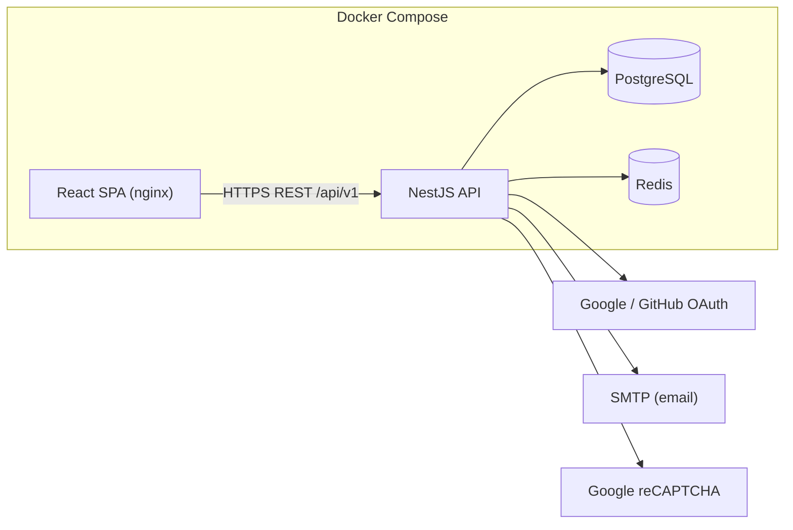

# Villi — B2C E-commerce Platform (Project 1: Foundation)

Villi is a Business-to-Consumer **curated marketplace for verified,
authenticated pre-loved Finnish/Nordic design high-end outdoor apparel** (e.g.
Fjällräven, Haglöfs, Luhta, Sasta, Norrøna, Klättermusen). This repository
implements **Project 1 — Foundation**: the core system that powers everything
else — secure user accounts, a well-structured ACID-compliant database, and a
searchable, faceted product catalog. It is built API-first and runs end-to-end
with a single Docker command.

Because every item is **pre-loved and one-of-a-kind**, each listing carries an
authenticity status, a condition grade, and a size — all expressed as faceted
attributes buyers can filter on, with stock fixed at one unit per item.

> Projects 2 (Commerce — cart/checkout/orders) and 3 (Experience — full UI,
> admin dashboards, accessibility & perf hardening) build on top of this
> Foundation. See [Roadmap](#roadmap).

### README deliverables (Project 1)

This file meets the required documentation deliverables:

| Deliverable | Section |
|-------------|---------|
| **Project overview** | [Project overview](#project-overview) (capabilities table) + introduction above |
| **Entity Relationship Diagram** | [Entity Relationship Diagram](#entity-relationship-diagram) (Mermaid ERD, PK/FK, cardinality, modality) |
| **Setup and installation** | [Setup and installation](#setup-and-installation) (Docker one-command + local dev) |
| **Usage guide** | [Usage guide](#usage-guide) (browse, auth, account, admin) |

Bonus material (API reference, security, testing, review checklists) follows below.

---

## Table of contents

**Core (required)**

- [Project overview](#project-overview)
- [Entity Relationship Diagram](#entity-relationship-diagram)
- [Setup and installation](#setup-and-installation) · [Which port to use](#which-port-to-use)
- [Usage guide](#usage-guide)

**Architecture & domain**

- [B2C e-commerce model](#b2c-e-commerce-model)
- [Tech stack](#tech-stack)
- [Architecture](#architecture)
- [API reference](#api-reference)
- [Security model](#security-model)
- [Testing](#testing) · [Testing review criteria (task1)](#testing-review-criteria-task1)
- [Manual test checklist](#manual-test-checklist)
- [Project structure](#project-structure)
- [Roadmap](#roadmap)

---

## Project overview

**Villi** is a B2C e-commerce **Foundation** for a curated pre-loved outdoor
apparel shop. Shoppers browse and search a product catalog; the platform handles
**accounts** (registration, login, JWT sessions, optional 2FA) and a **relational
catalog** (categories, brands, facets, reviews) backed by PostgreSQL. Commerce
(cart, checkout, payments) and the full admin UI are planned in later projects.

| Capability | Summary |
|---|---|
| **Accounts & auth** | Email/password + OAuth (Google, GitHub), CAPTCHA on signup, JWT access + rotating refresh tokens, token revocation, password reset, optional TOTP 2FA. |
| **Database** | PostgreSQL (relational, ACID) via Prisma. Transactions for multi-step writes, FKs/constraints for integrity. |
| **Catalog** | Full product model (id, name, description, price, stock, category, brand, images, metric+imperial dimensions), nested category browse, faceted search, sort by relevance/price/rating, static product images. See [Catalog review criteria](#catalog-review-criteria-task1). |
| **API-first** | Versioned (`/api/v1`), documented with Swagger/OpenAPI, global validation, consistent error shape, per-IP rate limiting. |
| **Ops** | Fully containerized; one command builds + runs the whole stack. |
| **Business model** | **B2C** — Villi (the business) sells directly to individual consumers; see [B2C e-commerce model](#b2c-e-commerce-model). |

---

## B2C e-commerce model

**Requirement:** The platform implements a Business-to-Consumer (B2C) e-commerce model.

Villi is a **single-store B2C** marketplace: one business operates the catalog and sells
**to end customers** (shoppers), not to other businesses.

| B2C characteristic | How Villi implements it |
|--------------------|-------------------------|
| **Customers are consumers** | Shoppers register with role `USER`, browse the public catalog, and (in Project 2) will check out as individuals — not as business accounts or wholesalers. |
| **Business → Consumer flow** | Products are listed by the platform (admin-managed catalog). There is no multi-vendor seller portal, B2B pricing tier, or purchase-order workflow in Foundation. |
| **Public storefront** | React SPA: search, facets, product detail, reviews — oriented at individual buyers. |
| **Curated retail positioning** | Pre-loved, one-of-a-kind Nordic outdoor apparel (`niche.txt`); `stockQuantity` is typically **1** per listing (consumer buys a unique item). |
| **Consumer accounts** | `User` model for shoppers; `ADMIN` for platform staff only — not a separate “merchant” entity. |

**Not in scope (by design):** B2B wholesale, marketplace sellers onboarding, corporate billing, or multi-tenant vendor stores (aligned with Project 1 Foundation; commerce features arrive in Project 2).

More detail: [`docs/TASK1_B2C_ERD.md`](docs/TASK1_B2C_ERD.md).

---

## Tech stack

- **Backend:** NestJS 11 (TypeScript), Prisma 6, Passport, `@nestjs/jwt`, argon2, otplib, Helmet, `@nestjs/throttler`.
- **Frontend:** React 18 + Vite + React Router (served by nginx in production).
- **Database:** PostgreSQL 16.
- **Cache / token store:** Redis 7 (search-suggestion cache + access-token revocation denylist).
- **Tooling:** ESLint, Prettier, Jest + Supertest, Docker / Docker Compose.

---

## Architecture



The platform is a **modular monolith**: one deployable API split into clear
feature modules (`auth`, `users`, `catalog`) plus shared infrastructure modules
(`prisma`, `redis`, `mail`). This keeps the Foundation simple to run and reason
about while leaving clean seams to extract services later if needed.

---

## Entity Relationship Diagram

**Requirement:** An ERD showing **entities**, **attributes**, **relationships**,
**primary keys (PK)**, **foreign keys (FK)**, **cardinality**, and **modality**.

Source of truth: `backend/prisma/schema.prisma`. Full tables and relationship
matrix: [`docs/TASK1_B2C_ERD.md`](docs/TASK1_B2C_ERD.md).

### Diagram (Crow’s foot notation)

```mermaid
erDiagram
  User ||--o| TwoFactorSecret : "has 0..1"
  User ||--o{ OAuthAccount : "links 0..N"
  User ||--o{ RefreshToken : "owns 0..N"
  User ||--o{ PasswordResetToken : "requests 0..N"
  User ||--o{ Review : "writes 0..N"

  Category ||--o{ Category : "parent 0..N children"
  Category ||--o{ Product : "contains 1..N"
  Brand ||--o{ Product : "makes 1..N"
  Product ||--o{ ProductImage : "has 1..N"
  Product ||--o{ ProductAttribute : "has 0..N"
  Product ||--o{ Review : "receives 0..N"

  User {
    uuid id PK
    string email UK
    string passwordHash "nullable"
    string firstName
    string lastName
    enum role
    bool isEmailVerified
    bool isActive
    datetime createdAt
    datetime updatedAt
  }
  TwoFactorSecret {
    uuid id PK
    uuid userId FK_UK
    string secret
    bool enabled
    string_array recoveryCodes
    datetime createdAt
    datetime confirmedAt "nullable"
  }
  OAuthAccount {
    uuid id PK
    enum provider
    string providerAccountId
    uuid userId FK
    datetime createdAt
    composite_UK provider_providerAccountId
  }
  RefreshToken {
    uuid id PK
    uuid userId FK
    string tokenHash UK
    string familyId
    datetime expiresAt
    datetime revokedAt "nullable"
    string replacedById "nullable"
    string userAgent "nullable"
    string ip "nullable"
    datetime createdAt
  }
  PasswordResetToken {
    uuid id PK
    uuid userId FK
    string tokenHash UK
    datetime expiresAt
    datetime usedAt "nullable"
    datetime createdAt
  }
  Category {
    uuid id PK
    string name
    string slug UK
    string description "nullable"
    uuid parentId FK "nullable self"
    datetime createdAt
  }
  Brand {
    uuid id PK
    string name UK
    string slug UK
    string description "nullable"
    string logoUrl "nullable"
    datetime createdAt
  }
  Product {
    uuid id PK
    string name
    string slug UK
    string description
    decimal price
    string currency
    int stockQuantity
    uuid categoryId FK
    uuid brandId FK
    int weightGrams "nullable"
    int lengthMm "nullable"
    int widthMm "nullable"
    int heightMm "nullable"
    float averageRating
    int ratingCount
    bool isActive
    datetime createdAt
    datetime updatedAt
  }
  ProductImage {
    uuid id PK
    uuid productId FK
    string url
    string altText "nullable"
    int position
    bool isPrimary
  }
  ProductAttribute {
    uuid id PK
    uuid productId FK
    string name
    string value
    composite_UK productId_name
  }
  Review {
    uuid id PK
    uuid productId FK
    uuid userId FK
    int rating
    string title "nullable"
    string body "nullable"
    datetime createdAt
    composite_UK productId_userId
  }
```

### Notation legend

| Symbol / term | Meaning |
|---------------|---------|
| **PK** | Primary key — unique row identifier (`@id` in Prisma) |
| **FK** | Foreign key — references another entity’s PK (`@relation`) |
| **UK** | Alternate unique key (`@unique` or `@@unique`) |
| **Cardinality** | Maximum multiplicity on each side (one vs many), shown on diagram edges |
| **Modality** | Minimum participation (optional `0` vs mandatory `1`) |

**Mermaid edge cheat sheet**

| Syntax | Cardinality | Modality (child side) |
|--------|-------------|------------------------|
| `\|\|--o\|` | 1 : 0..1 | Child optional (at most one) |
| `\|\|--o{` | 1 : 0..N | Child optional, many allowed |
| `\|\|--\|{` | 1 : 1..N | Child mandatory, many allowed |

### Relationships (cardinality + modality + FK)

| Relationship | Cardinality | Modality | Foreign key |
|--------------|-------------|----------|-------------|
| User → TwoFactorSecret | 1 : 0..1 | 2FA optional per user; if present, exactly one row per user | `TwoFactorSecret.userId` → `User.id` |
| User → OAuthAccount | 1 : 0..N | OAuth optional; user may link multiple providers | `OAuthAccount.userId` → `User.id` |
| User → RefreshToken | 1 : 0..N | Zero or many active/historical sessions | `RefreshToken.userId` → `User.id` |
| User → PasswordResetToken | 1 : 0..N | Zero or many reset requests over time | `PasswordResetToken.userId` → `User.id` |
| User → Review | 1 : 0..N | Shoppers may write zero or many reviews | `Review.userId` → `User.id` |
| Category → Category (tree) | 1 : 0..N | Root categories have `parentId` null; optional hierarchy | `Category.parentId` → `Category.id` |
| Category → Product | 1 : 0..N | Each product in exactly one category; category may be empty | `Product.categoryId` → `Category.id` |
| Brand → Product | 1 : 0..N | Each product has one brand; brand may have zero products | `Product.brandId` → `Brand.id` |
| Product → ProductImage | 1 : 0..N | Images optional; usually one or more per product | `ProductImage.productId` → `Product.id` |
| Product → ProductAttribute | 1 : 0..N | Facets optional (condition, size, colour, etc.) | `ProductAttribute.productId` → `Product.id` |
| Product → Review | 1 : 0..N | Reviews optional; aggregates on `Product` | `Review.productId` → `Product.id` |

**ACID notes:** multi-step operations (OAuth provisioning + linking, refresh
rotation, password reset + session revocation, product creation with
images/attributes, review + rating recompute) run inside Prisma `$transaction`s
(atomic & isolated). Foreign keys and unique constraints enforce consistency;
PostgreSQL guarantees durability of committed transactions. Dimensions are
stored once in canonical **metric base units** and imperial values are derived
in the API to avoid redundant, drift-prone data.

---

## Setup and installation

Follow these steps to run the full stack locally or to prepare a machine for
review. Only **Docker** is required for the primary path.

### Prerequisite

**Docker** (with Docker Compose v2) is the only requirement. All application
dependencies (Node, PostgreSQL, Redis, nginx) are included in the containers.

### Which port to use

**Open the app at http://localhost:8080** — that is the intended URL for daily use,
reviews, OAuth, and sign-in. The default `.env` is configured for this **unified
gateway** (`proxy` service): one origin serves both the React storefront and
`/api/v1`, so cookies and OAuth work without cross-port issues.

| Port | URL | When to use |
|------|-----|-------------|
| **8080** (recommended) | http://localhost:8080 | **Default.** Browse, login, OAuth, register. API at `/api/v1`, Swagger at `/api/docs`. |
| 5173 | http://localhost:5173 | Web UI only — only if you deliberately use [split-port](#changing-ports) mode and rebuilt `web` for it. |
| 3001 | http://localhost:3001/api/v1 | API / Swagger direct access — debugging, not the main storefront URL. |

**Do not** expect the app on other ports (e.g. `8081`, `5174`) unless you changed
`PROXY_HOST_PORT`, `WEB_HOST_PORT`, or `API_HOST_PORT` in `.env` **and** rebuilt
the stack. Random localhost ports usually mean an old bookmark or another project.

Start all services including the gateway:

```bash
./start.sh -d
# or: docker compose up --build -d api web proxy
```

Detached mode prints URLs when ready. Foreground: `./start.sh` (URLs shown before logs).

**Changing ports** — edit `.env`, then rebuild:

| Variable | Default | Maps to |
|----------|---------|---------|
| `PROXY_HOST_PORT` | `8080` | Unified gateway (browse here) |
| `WEB_HOST_PORT` | `5173` | Frontend container only |
| `API_HOST_PORT` | `3001` | API container only |

If you change `PROXY_HOST_PORT`, also set `API_PUBLIC_URL`, `WEB_PUBLIC_URL`, and
`VITE_API_BASE_URL=/api/v1` for that origin, update OAuth callback URLs, and run
`docker compose up --build -d api web proxy`. See [`docs/OAUTH_SETUP.md`](docs/OAUTH_SETUP.md).

**Split-port mode** (optional): browse `:5173` with `VITE_API_BASE_URL=http://localhost:3001/api/v1`
and matching OAuth callbacks on `:3001` — do not mix with the `:8080` defaults.

### Run everything (one command)

```bash
./start.sh
```

This copies `.env.example` to `.env` if missing, then builds and starts
PostgreSQL, Redis, the API, the web app, and the **proxy** on port **8080**.
On first boot the API container automatically applies migrations and seeds sample data.

Equivalently:

```bash
cp .env.example .env
docker compose up --build -d api web proxy
```

**Use this URL:** http://localhost:8080 (see [Which port to use](#which-port-to-use)).

| Service | URL |
|---|---|
| **Storefront + API (use this)** | **http://localhost:8080** |
| Web only (split-port / debugging) | http://localhost:5173 |
| API only (Swagger, curl) | http://localhost:3001/api/v1 |
| Swagger docs | http://localhost:8080/api/docs or http://localhost:3001/api/docs |
| Health check | http://localhost:8080/api/v1/health |

> **Port already in use?** If `3001`, `5173`, or `8080` are taken on your machine,
> set `API_HOST_PORT` / `WEB_HOST_PORT` / `PROXY_HOST_PORT` in `.env` (Postgres and
> Redis are internal-only and never bind host ports).

### Share with remote reviewers (ngrok)

Auth refresh cookies require the browser to talk to **one origin** for both the
SPA and `/api/v1`. A small **nginx proxy** (`proxy/nginx.conf`, port **8080**)
routes `/` → web and `/api/` → API so ngrok can expose a single HTTPS URL.

```bash
# Install ngrok and configure your authtoken first: https://ngrok.com/download
./ngrok.sh
```

This starts Docker (including the proxy), opens an ngrok tunnel to port 8080,
updates `.env` with the public URL, rebuilds the web app, and restarts the API
(CORS + secure cookies). Share the printed HTTPS link with reviewers.

To point at a known URL (e.g. reserved ngrok domain) without auto-detect:

```bash
./scripts/configure-public-url.sh https://your-name.ngrok-free.app
ngrok http 8080
```

### Seeded accounts

| Role | Email | Password |
|---|---|---|
| Admin | `admin@villi.test` | `Admin!Passw0rd` |
| Customer | `shopper@villi.test` | `Shopper!Passw0rd` |

> Configure OAuth, reCAPTCHA, and SMTP by filling in the matching variables in
> `.env`. When left blank, CAPTCHA enforcement is skipped and emails are logged
> to the API container console so every flow remains testable locally.

### Local development (without Docker)

You need Node 20+, PostgreSQL, and Redis running locally.

```bash
# Backend
cd backend
npm install
cp ../.env.example .env   # adjust DATABASE_URL / REDIS_URL to localhost
npx prisma migrate deploy
npm run prisma:seed
npm run start:dev          # http://localhost:3001

# Frontend (in another terminal)
cd frontend
npm install
npm run dev                # http://localhost:5173
```

---

## Usage guide

After [setup](#run-everything-one-command), open **http://localhost:8080** ([which port to use](#which-port-to-use)).
Sign in with a [seeded account](#seeded-accounts) to try authenticated flows.

### Shopper flows

1. **Browse & search** — the landing page lists products. Use the search bar
   for live type-ahead suggestions, the left rail to filter by category, price,
   brand, rating, and attribute facets (e.g. size, condition, colour), and the sort
   dropdown for relevance / price / rating / newest.
2. **Reviews & ratings** — open any product to read customer reviews. Signed-in
   users can leave a 1–5 star review (one per product, editable); a product's
   star rating and count are computed from these real reviews and feed the
   rating facet/sort.
3. **Register** — create an account (CAPTCHA shown when a site key is set).
   Forms validate **on the client** (email format, password strength, required
   fields) for instant feedback, and again on the server. You are signed in
   immediately; the access token lives only in memory.
4. **Sign in** — email/password or an OAuth provider. If 2FA is enabled you are
   prompted for a 6-digit code.
5. **Account page** — enable/disable TOTP 2FA (scan the QR with Google
   Authenticator/Authy and save recovery codes), export your data, or delete
   your account (GDPR).
6. **Admin** — sign in as the admin to create/update products, categories, and
   brands via the API (admin-guarded endpoints; see Swagger).

### Quick reviewer walkthrough

| Step | Action |
|------|--------|
| 1 | `./start.sh -d` — wait until API, web, and proxy are up |
| 2 | Open **http://localhost:8080** — browse catalog, use facets and sort |
| 3 | Open a product — check images, specs (metric + imperial), reviews |
| 4 | Register or sign in as `shopper@villi.test` / `Shopper!Passw0rd` |
| 5 | Account → optional 2FA; API docs at http://localhost:3001/api/docs |
| 6 | Run tests: `docker compose --profile test run --rm e2e` (see [Testing](#testing)) |

### Password reset (optional demo)

1. Go to **Forgot password** → enter an email → check API logs for `[DEV EMAIL]` reset link (SMTP optional).
2. Open the link → set a new password → sign in.

---

## API reference

Base URL: `http://localhost:3001/api/v1`. Full interactive docs at `/api/docs`.

### Auth
| Method | Path | Description |
|---|---|---|
| POST | `/auth/register` | Register (email/password, CAPTCHA) |
| POST | `/auth/login` | Login; returns access token (+ refresh cookie) |
| POST | `/auth/refresh` | Rotate refresh token, get new access token |
| POST | `/auth/logout` | Revoke current refresh + access token |
| POST | `/auth/forgot-password` | Request reset email |
| POST | `/auth/reset-password` | Set new password from token |
| GET/POST | `/auth/2fa/status\|setup\|enable\|disable` | Manage TOTP 2FA |
| GET | `/auth/oauth/google\|github` | Start OAuth flow |

### Users
| Method | Path | Description |
|---|---|---|
| GET | `/users/me` | Current profile |
| GET | `/users/me/export` | GDPR data export |
| DELETE | `/users/me` | GDPR account deletion |

### Catalog
| Method | Path | Description |
|---|---|---|
| GET | `/products` | Faceted search + sort + pagination |
| GET | `/products/suggest?q=` | Type-ahead suggestions |
| GET | `/products/facets` | Facet values + counts for current filters |
| GET | `/products/:idOrSlug` | Product detail |
| POST/PATCH/DELETE | `/products[/:id]` | Admin product management |
| GET | `/products/:idOrSlug/reviews` | List reviews + rating summary |
| POST | `/products/:idOrSlug/reviews` | Create/update your review (auth) |
| DELETE | `/products/:idOrSlug/reviews/mine` | Delete your own review (auth) |
| GET | `/categories`, `/categories/tree` | Browse categories |
| GET | `/brands` | List brands |

**Example — faceted search:**
```
GET /api/v1/products?q=jacket&category=shell-jackets&brands=fjallraven&brands=haglofs\
&minPrice=100&maxPrice=300&minRating=4&attributes=size:M&attributes=condition:Very Good&sort=price_asc&page=1&limit=20
```

---

## Security model

- **Passwords** hashed with **argon2**. Password rules enforced server-side.
- **CAPTCHA** (Google reCAPTCHA) verified server-side on registration.
- **JWT access tokens** are short-lived (default 15m) and returned in the
  response body — the SPA keeps them **in memory only** (never localStorage).
- **Refresh tokens** are long-lived (default 7d), opaque, stored only as a
  SHA-256 hash, and delivered as an **httpOnly, SameSite** cookie scoped to
  `/api/v1/auth`.
- **Refresh-token rotation:** every refresh issues a new token and single-use
  invalidates the old one. Presenting an already-rotated token (theft) revokes
  the entire token **family**.
- **Revocation:** logout revokes the refresh token and denylists the access
  token's `jti` in Redis until it would naturally expire.
- **2FA:** optional TOTP with hashed single-use recovery codes.
- **Transport/headers:** Helmet, strict CORS (credentials limited to the web
  origin), global input validation with unknown-field stripping.
- **Rate limiting:** per-IP throttling globally, with tighter limits on
  auth-sensitive endpoints.
- **Injection safety:** Prisma parameterizes all queries; user input is treated
  strictly as data.
- **GDPR:** data export + account erasure endpoints; no-user-enumeration on
  login and password reset.

---

## Testing

Frameworks: **Jest** (+ ts-jest) for unit tests, **Supertest** for API
integration/security tests.

### Testing review criteria (task1)

| Criterion | Status | Count | How to demonstrate |
|-----------|--------|-------|-------------------|
| **Unit tests** | Done | **34** (`src/**/*.spec.ts`) | `cd backend && npm test` — JWT, auth DTO validation, CAPTCHA, product DTO/model, dimensions. No DB. |
| **API integration tests** | Done | **32** e2e (`test/app.e2e-spec.ts`) | Real HTTP + PostgreSQL: auth register/login, catalog CRUD/list/facets, token rotation, reviews. `npm run test:e2e` or Docker below. |
| **Security tests** | Done | Unit DTO + **6** e2e in `security:` block | Malformed/extra fields, SQLi-style login/search/path, admin guard. Run `npx jest test/app.e2e-spec.ts -t security`. |
| **Auth + catalog coverage** | Done | Both domains in unit and e2e | See matrix in [`docs/TASK1_TESTING.md`](docs/TASK1_TESTING.md). |
| **Explain & demo** | Done | Oral script in testing doc | Walk through one unit file + one e2e block; run `docker compose --profile test run --rm e2e`. |

**Explain to a reviewer:** Unit tests prove isolated logic (tokens, validation, product shape). E2e tests boot the full API and hit Postgres so endpoints and persistence are real. Security tests send malicious strings and assert safe status codes (400/401/404) and an intact database.

**Run the whole suite with only Docker** (unit + integration + security, against
a throwaway DB on the internal network — no host ports needed):

```bash
docker compose --profile test run --rm e2e
```

Or run pieces locally (Node 20+):

```bash
cd backend
npm test          # 34 unit tests (no DB required)
npm run test:cov  # unit tests with coverage
npm run test:e2e  # 32 API integration + security tests (needs a reachable DB + Redis)
```

**Unit tests** (34) cover:
- **JWT token handling** — generation, claims, expiration, refresh-token
  rotation, and reuse/family-revocation detection (`src/auth/tokens.service.spec.ts`).
- **User input validation** — registration/login DTO rules incl. injection-style
  input (`src/auth/dto/auth.dto.spec.ts`).
- **CAPTCHA** — dev skip, token required when secret set, siteverify success/failure
  (`src/auth/captcha.service.spec.ts`).
- **Product data model** — required-field & nested validation of the product
  DTOs and faceted-query DTO (`src/catalog/dto/product.dto.spec.ts`), the public
  product shape incl. derived fields (`src/catalog/products.service.spec.ts`), and
  metric/imperial dimension correctness (`src/common/utils/units.spec.ts`).

**API integration + security tests** (32, `test/app.e2e-spec.ts`) cover:
- **Catalog endpoints** — list/pagination, single product by slug (+404),
  facets, faceted filtering by brand and attribute, price filtering, sorting by
  price and rating, invalid-sort rejection, suggestions, and the category tree.
- **Reviews** — public listing + rating summary, auth-gated creation, rating
  range validation (400), aggregate recomputation on the product, edit-not-
  duplicate on re-submit, and owner deletion.
- **Auth & persistence** — register (persisted + retrieved via `/users/me`),
  duplicate rejection, login success/failure, and bearer-token enforcement.
- **Refresh-token rotation** — single-use validation: a rotated token is
  rejected on reuse, and reuse detection burns the whole token family; logout
  revokes both the access (Redis denylist) and refresh tokens.
- **Security** — malformed/extra-field rejection, SQL-injection-as-data (catalog
  stays intact), injection in path params (404, not 500), and admin-only guards.

---

## Auth review criteria (task1)

Use this when a reviewer checks the six authentication deliverables. Each item is
**already implemented**; the table points to code and how to demonstrate it.

| Criterion | Status | Where | How to demonstrate |
|-----------|--------|-------|-------------------|
| **Email-password + OAuth** | Done | Email: `POST /auth/register`, `POST /auth/login`. OAuth: `GET /auth/oauth/google`, `GET /auth/oauth/github` + callbacks; `findOrCreateFromOAuth()` links providers to existing emails. UI: `/register`, `/login` + `OAuthButtons.tsx`. E2E: *auth flow* + *OAuth authentication methods*. | Register/sign in with email. OAuth: set `GOOGLE_*` / `GITHUB_*` + `VITE_*_OAUTH_ENABLED=true` per `docs/OAUTH_SETUP.md`, rebuild `web`, then **Continue with Google/GitHub**. |
| **Access token in memory** | Done | `frontend/src/api/client.ts` (`let accessToken` module variable); `AuthContext` calls `setAccessToken` only — never `localStorage`/`sessionStorage` for JWT | DevTools → Application → Local Storage: no access token. After login, API calls send `Authorization: Bearer …` from memory; reload tab loses access until `/auth/refresh` restores session via cookie. |
| **Refresh rotation (single-use)** | Done | `backend/src/auth/tokens.service.ts` `rotate()` — marks old token `revokedAt` + `replacedById`, issues new cookie | Automated: `docker compose --profile test run --rm e2e` → test *"rotates the refresh token and rejects reuse of the old one"*. Manual: login → call `POST /auth/refresh` twice with the **first** cookie → second call returns **401**; reusing a rotated token burns the family. |
| **Revocation (access + refresh)** | Done | Refresh: `revokeRefreshToken` on logout; access: Redis denylist by `jti` in `jwt.strategy.ts` + `auth.controller.ts` `logout()` | E2E test *"revokes tokens on logout"*. After logout, `GET /users/me` with old bearer → **401**; `POST /auth/refresh` with old cookie → **401**. |
| **Password reset via email** | Done | `POST /auth/forgot-password`, `POST /auth/reset-password`; `mail.service.ts` `sendPasswordReset()` | Forgot password on `/forgot-password` → check API logs for `[DEV EMAIL]` with reset link (or real SMTP if configured) → open `/reset-password?token=…` → sign in with new password. |
| **Client + server validation** | Done | Server: `backend/src/auth/dto/auth.dto.ts` + global `ValidationPipe`. Client: `frontend/src/utils/validation.ts` on Login, Register, Forgot, Reset (+ 2FA step on Login) | Submit empty/weak fields → inline errors before request; server still returns **400** if client is bypassed. |

More detail: [`docs/TASK1_AUTH_REVIEW.md`](docs/TASK1_AUTH_REVIEW.md).

## CAPTCHA & 2FA review criteria (task1)

| Criterion | Status | Where | How to demonstrate |
|-----------|--------|-------|-------------------|
| **CAPTCHA on registration** | Done | `Recaptcha.tsx` on `/register`; `auth.service.ts` calls `CaptchaService.verify()`; `captcha.service.spec.ts` | With keys in `.env`: widget on register, cannot submit until checked. Without keys: note on form + server skips (dev). Unit tests cover enforce/skip logic. |
| **Optional user-enabled 2FA** | Done | `/account` → Enable 2FA; `two-factor.service.ts` (TOTP + recovery codes); login 2FA step on `/login` | Enable on Account → sign out → login asks for code. Disabled by default; user opts in and can disable later. |

Full walkthrough: [`docs/TASK1_AUTH_REVIEW.md`](docs/TASK1_AUTH_REVIEW.md) §7–8.

## Catalog review criteria (task1)

| Criterion | Status | Where | How to demonstrate |
|-----------|--------|-------|-------------------|
| **Product data model (all fields)** | Done | `prisma/schema.prisma` `Product` + `ProductImage`; API `ProductsService.toPublic()` + `buildDimensions()` | `GET /api/v1/products?limit=1` — check id, name, description, price, stockQuantity, category, brand, images, dimensions.metric + dimensions.imperial. Unit test: `products.service.spec.ts`. |
| **Categories / browsing** | Done | Nested `Category` tree; `GET /categories/tree`; sidebar on home | Pick a subcategory (e.g. Shell Jackets) — listing updates. |
| **Faceted search** | Done | `GET /products` + `GET /products/facets`; `buildWhere()` | Filter by brand, min/max price, min rating, attribute facets (`condition:Very Good`). |
| **Sorting** | Done | `ProductSort` enum: relevance, price_asc, price_desc, rating | Sort dropdown on catalog; e2e tests for price + rating. |
| **Product images** | Done | `frontend/public/products/*.png`; `ProductImage` URLs; nginx `/products/` | Images on cards; `curl -I http://localhost:5173/products/keb-shell.png` → 200. |

Full walkthrough: [`docs/TASK1_CATALOG.md`](docs/TASK1_CATALOG.md).

---

## B2C & ERD review criteria (task1)

| Criterion | Status | Where | How to demonstrate |
|-----------|--------|-------|-------------------|
| **B2C e-commerce model** | Done | Consumer `USER` role, public catalog, platform-operated inventory, no seller/B2B entities | README [B2C e-commerce model](#b2c-e-commerce-model); browse as shopper; explain Villi sells to individuals. |
| **ERD (full)** | Done | README [Entity Relationship Diagram](#entity-relationship-diagram) + [`docs/TASK1_B2C_ERD.md`](docs/TASK1_B2C_ERD.md) | Mermaid diagram with entities/attributes/PK/FK; relationship table with **cardinality** and **modality**; matches `prisma/schema.prisma`. |

---

## Manual test checklist

Run periodically (these guard against vulnerability-seeking bots and verify
third-party flows that are hard to fully automate):

- [ ] **CAPTCHA** — with `RECAPTCHA_SECRET`/`VITE_RECAPTCHA_SITE_KEY` set,
  registration shows the widget and fails server-side without a valid token.
- [ ] **OAuth (Google)** — "Continue with Google" completes and lands signed-in
  on `/oauth/callback`, linking/creating the account.
- [ ] **OAuth (GitHub)** — same flow via GitHub.
- [ ] **2FA setup** — enable on the Account page, scan the QR, verify a code,
  confirm recovery codes are shown once.
- [ ] **2FA login** — sign out and back in; confirm the 6-digit code prompt and
  that a recovery code works as a fallback.

---

## Project structure

```
.
├── proxy/nginx.conf          # unified gateway (/ → web, /api → api)
├── ngrok.sh                  # remote demo via single HTTPS origin
├── docker-compose.yml        # postgres + redis + api + web + proxy
├── start.sh                  # one-command build & run
├── .env.example              # all configuration (12-factor)
├── backend/                  # NestJS API
│   ├── prisma/               # schema, migrations, seed
│   └── src/
│       ├── auth/             # auth, JWT, OAuth, 2FA, captcha
│       ├── users/            # profile + GDPR
│       ├── catalog/          # products, categories, brands, search
│       ├── common/           # guards, filters, decorators, utils
│       ├── prisma|redis|mail/# infrastructure modules
│       └── main.ts           # bootstrap (Swagger, validation, security)
└── frontend/                 # React + Vite SPA (nginx in prod)
    └── src/{api,auth,components,pages}
```

---

## Roadmap

- **Project 2 — Commerce:** shopping cart, checkout, payment integration, and
  order lifecycle. Reuses Foundation auth + catalog; adds transactional stock
  decrement (`SELECT ... FOR UPDATE`) on order placement.
- **Project 3 — Experience:** complete customer UI, admin dashboards, WCAG 2.1
  Level A accessibility, performance optimization (query tuning, caching, FE
  optimizations), and production hardening.

## Additional features implemented (bonus)

- Refresh-token **family reuse detection** (theft mitigation).
- Redis-backed **access-token revocation** denylist.
- **Faceted** filtering with live counts + attribute facets (condition, size, colour, material, authenticity).
- **Customer reviews & ratings** — 1–5 stars with title/body; product rating
  aggregates are **recomputed transactionally** from real review rows (the
  rating facet/sort use genuine data, not seeded numbers).
- **Client + server validation** on auth forms with inline, accessible
  (`aria-invalid`) error messages mirroring the server rules.
- **Verified-authentic** + **condition** trust badges surfaced per item.
- Dual **metric/imperial** product dimensions.
- **GDPR** data export & erasure endpoints.
- Containerized **one-command** startup with auto-migrate + seed.
