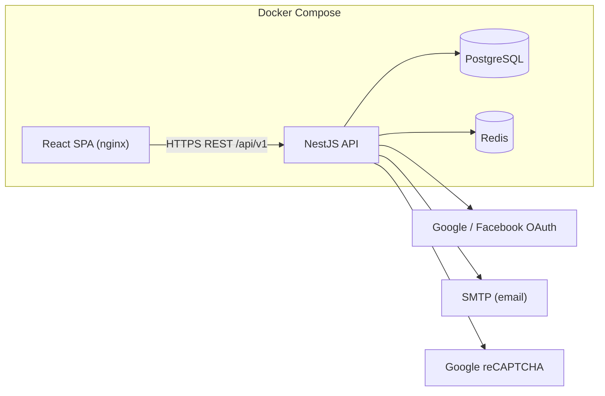
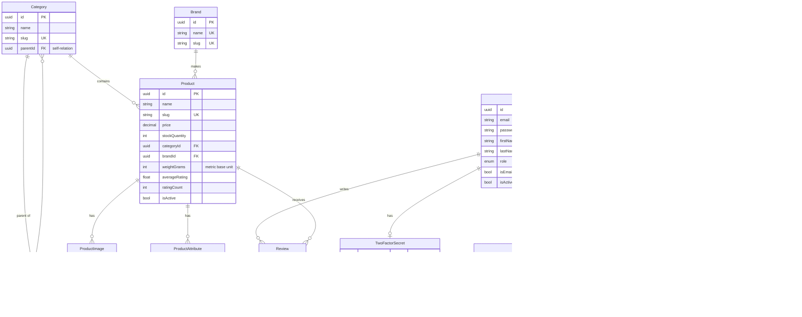

# Villi — B2C E-commerce Platform (Project 1: Foundation)

Villi is a Business-to-Consumer **curated marketplace for verified,
authenticated pre-loved Finnish/Nordic design high-end outdoor apparel** (e.g.
Fjällräven, Haglöfs, Luhta, Sasta, Norrøna, Klättermusen). This repository
implements **Project 1 — Foundation**: the core system that powers everything
else — secure user accounts, a well-structured ACID-compliant database, and a
searchable, faceted product catalog. It is built API-first and runs end-to-end
with a single Docker command.

Because every item is **pre-loved and one-of-a-kind**, each listing carries an
authenticity status, a condition grade, and a size — all expressed as faceted
attributes buyers can filter on, with stock fixed at one unit per item.

> Projects 2 (Commerce — cart/checkout/orders) and 3 (Experience — full UI,
> admin dashboards, accessibility & perf hardening) build on top of this
> Foundation. See [Roadmap](#roadmap).

---

## Table of contents

- [Project overview](#project-overview)
- [Tech stack](#tech-stack)
- [Architecture](#architecture)
- [Entity Relationship Diagram](#entity-relationship-diagram)
- [Setup and installation](#setup-and-installation)
- [Usage guide](#usage-guide)
- [API reference](#api-reference)
- [Security model](#security-model)
- [Testing](#testing)
- [Manual test checklist](#manual-test-checklist)
- [Project structure](#project-structure)
- [Roadmap](#roadmap)

---

## Project overview

| Capability | Summary |
|---|---|
| **Accounts & auth** | Email/password + OAuth (Google, Facebook), CAPTCHA on signup, JWT access + rotating refresh tokens, token revocation, password reset, optional TOTP 2FA. |
| **Database** | PostgreSQL (relational, ACID) via Prisma. Transactions for multi-step writes, FKs/constraints for integrity. |
| **Catalog** | Nested categories, Nordic brands, unique pre-loved items with metric+imperial dimensions and condition/size/authenticity facets, faceted search, live suggestions, sorting, pagination. |
| **API-first** | Versioned (`/api/v1`), documented with Swagger/OpenAPI, global validation, consistent error shape, per-IP rate limiting. |
| **Ops** | Fully containerized; one command builds + runs the whole stack. |

---

## Tech stack

- **Backend:** NestJS 11 (TypeScript), Prisma 6, Passport, `@nestjs/jwt`, argon2, otplib, Helmet, `@nestjs/throttler`.
- **Frontend:** React 18 + Vite + React Router (served by nginx in production).
- **Database:** PostgreSQL 16.
- **Cache / token store:** Redis 7 (search-suggestion cache + access-token revocation denylist).
- **Tooling:** ESLint, Prettier, Jest + Supertest, Docker / Docker Compose.

---

## Architecture



The platform is a **modular monolith**: one deployable API split into clear
feature modules (`auth`, `users`, `catalog`) plus shared infrastructure modules
(`prisma`, `redis`, `mail`). This keeps the Foundation simple to run and reason
about while leaving clean seams to extract services later if needed.

---

## Entity Relationship Diagram



**ACID notes:** multi-step operations (OAuth provisioning + linking, refresh
rotation, password reset + session revocation, product creation with
images/attributes) run inside Prisma `$transaction`s (atomic & isolated).
Foreign keys and unique constraints enforce consistency; PostgreSQL guarantees
durability of committed transactions. Dimensions are stored once in canonical
**metric base units** and imperial values are derived in the API to avoid
redundant, drift-prone data.

---

## Setup and installation

### Prerequisite

**Docker** (with Docker Compose v2) is the only requirement. All application
dependencies are included in the containers.

### Run everything (one command)

```bash
./start.sh
```

This copies `.env.example` to `.env` if missing, then builds and starts
PostgreSQL, Redis, the API, and the web app. On first boot the API container
automatically applies migrations and seeds sample data.

Equivalently:

```bash
cp .env.example .env
docker compose up --build
```

Then open:

| Service | URL |
|---|---|
| Web app | http://localhost:5173 |
| API | http://localhost:3001/api/v1 |
| Swagger docs | http://localhost:3001/api/docs |
| Health check | http://localhost:3001/api/v1/health |

> **Port already in use?** If `3001` or `5173` are taken on your machine, set
> `API_HOST_PORT` / `WEB_HOST_PORT` in `.env` (the Postgres and Redis containers
> are internal-only and never bind host ports).

### Seeded accounts

| Role | Email | Password |
|---|---|---|
| Admin | `admin@villi.test` | `Admin!Passw0rd` |
| Customer | `shopper@villi.test` | `Shopper!Passw0rd` |

> Configure OAuth, reCAPTCHA, and SMTP by filling in the matching variables in
> `.env`. When left blank, CAPTCHA enforcement is skipped and emails are logged
> to the API container console so every flow remains testable locally.

### Local development (without Docker)

You need Node 20+, PostgreSQL, and Redis running locally.

```bash
# Backend
cd backend
npm install
cp ../.env.example .env   # adjust DATABASE_URL / REDIS_URL to localhost
npx prisma migrate deploy
npm run prisma:seed
npm run start:dev          # http://localhost:3001

# Frontend (in another terminal)
cd frontend
npm install
npm run dev                # http://localhost:5173
```

---

## Usage guide

1. **Browse & search** — the landing page lists products. Use the search bar
   for live type-ahead suggestions, the left rail to filter by category, price,
   brand, rating, and attribute facets (e.g. size, condition, colour), and the sort
   dropdown for relevance / price / rating / newest.
2. **Register** — create an account (CAPTCHA shown when a site key is set). You
   are signed in immediately; the access token lives only in memory.
3. **Sign in** — email/password or an OAuth provider. If 2FA is enabled you are
   prompted for a 6-digit code.
4. **Account page** — enable/disable TOTP 2FA (scan the QR with Google
   Authenticator/Authy and save recovery codes), export your data, or delete
   your account (GDPR).
5. **Admin** — sign in as the admin to create/update products, categories, and
   brands via the API (admin-guarded endpoints; see Swagger).

---

## API reference

Base URL: `http://localhost:3001/api/v1`. Full interactive docs at `/api/docs`.

### Auth
| Method | Path | Description |
|---|---|---|
| POST | `/auth/register` | Register (email/password, CAPTCHA) |
| POST | `/auth/login` | Login; returns access token (+ refresh cookie) |
| POST | `/auth/refresh` | Rotate refresh token, get new access token |
| POST | `/auth/logout` | Revoke current refresh + access token |
| POST | `/auth/forgot-password` | Request reset email |
| POST | `/auth/reset-password` | Set new password from token |
| GET/POST | `/auth/2fa/status\|setup\|enable\|disable` | Manage TOTP 2FA |
| GET | `/auth/oauth/google\|facebook` | Start OAuth flow |

### Users
| Method | Path | Description |
|---|---|---|
| GET | `/users/me` | Current profile |
| GET | `/users/me/export` | GDPR data export |
| DELETE | `/users/me` | GDPR account deletion |

### Catalog
| Method | Path | Description |
|---|---|---|
| GET | `/products` | Faceted search + sort + pagination |
| GET | `/products/suggest?q=` | Type-ahead suggestions |
| GET | `/products/facets` | Facet values + counts for current filters |
| GET | `/products/:idOrSlug` | Product detail |
| POST/PATCH/DELETE | `/products[/:id]` | Admin product management |
| GET | `/categories`, `/categories/tree` | Browse categories |
| GET | `/brands` | List brands |

**Example — faceted search:**
```
GET /api/v1/products?q=jacket&category=shell-jackets&brands=fjallraven&brands=haglofs\
&minPrice=100&maxPrice=300&minRating=4&attributes=size:M&attributes=condition:Very Good&sort=price_asc&page=1&limit=20
```

---

## Security model

- **Passwords** hashed with **argon2**. Password rules enforced server-side.
- **CAPTCHA** (Google reCAPTCHA) verified server-side on registration.
- **JWT access tokens** are short-lived (default 15m) and returned in the
  response body — the SPA keeps them **in memory only** (never localStorage).
- **Refresh tokens** are long-lived (default 7d), opaque, stored only as a
  SHA-256 hash, and delivered as an **httpOnly, SameSite** cookie scoped to
  `/api/v1/auth`.
- **Refresh-token rotation:** every refresh issues a new token and single-use
  invalidates the old one. Presenting an already-rotated token (theft) revokes
  the entire token **family**.
- **Revocation:** logout revokes the refresh token and denylists the access
  token's `jti` in Redis until it would naturally expire.
- **2FA:** optional TOTP with hashed single-use recovery codes.
- **Transport/headers:** Helmet, strict CORS (credentials limited to the web
  origin), global input validation with unknown-field stripping.
- **Rate limiting:** per-IP throttling globally, with tighter limits on
  auth-sensitive endpoints.
- **Injection safety:** Prisma parameterizes all queries; user input is treated
  strictly as data.
- **GDPR:** data export + account erasure endpoints; no-user-enumeration on
  login and password reset.

---

## Testing

Frameworks: **Jest** (+ ts-jest) for unit tests, **Supertest** for API
integration/security tests.

**Run the whole suite with only Docker** (unit + integration + security, against
a throwaway DB on the internal network — no host ports needed):

```bash
docker compose --profile test run --rm e2e
```

Or run pieces locally (Node 20+):

```bash
cd backend
npm test          # 29 unit tests (no DB required)
npm run test:cov  # unit tests with coverage
npm run test:e2e  # 24 API integration + security tests (needs a reachable DB + Redis)
```

**Unit tests** (29) cover:
- **JWT token handling** — generation, claims, expiration, refresh-token
  rotation, and reuse/family-revocation detection (`src/auth/tokens.service.spec.ts`).
- **User input validation** — registration/login DTO rules incl. injection-style
  input (`src/auth/dto/auth.dto.spec.ts`).
- **Product data model** — required-field & nested validation of the product
  DTOs and faceted-query DTO (`src/catalog/dto/product.dto.spec.ts`), the public
  product shape incl. derived fields (`src/catalog/products.service.spec.ts`), and
  metric/imperial dimension correctness (`src/common/utils/units.spec.ts`).

**API integration + security tests** (24, `test/app.e2e-spec.ts`) cover:
- **Catalog endpoints** — list/pagination, single product by slug (+404),
  facets, faceted filtering by brand and attribute, price filtering, sorting by
  price and rating, invalid-sort rejection, suggestions, and the category tree.
- **Auth & persistence** — register (persisted + retrieved via `/users/me`),
  duplicate rejection, login success/failure, and bearer-token enforcement.
- **Refresh-token rotation** — single-use validation: a rotated token is
  rejected on reuse, and reuse detection burns the whole token family; logout
  revokes both the access (Redis denylist) and refresh tokens.
- **Security** — malformed/extra-field rejection, SQL-injection-as-data (catalog
  stays intact), injection in path params (404, not 500), and admin-only guards.

---

## Manual test checklist

Run periodically (these guard against vulnerability-seeking bots and verify
third-party flows that are hard to fully automate):

- [ ] **CAPTCHA** — with `RECAPTCHA_SECRET`/`VITE_RECAPTCHA_SITE_KEY` set,
  registration shows the widget and fails server-side without a valid token.
- [ ] **OAuth (Google)** — "Continue with Google" completes and lands signed-in
  on `/oauth/callback`, linking/creating the account.
- [ ] **OAuth (Facebook)** — same flow via Facebook.
- [ ] **2FA setup** — enable on the Account page, scan the QR, verify a code,
  confirm recovery codes are shown once.
- [ ] **2FA login** — sign out and back in; confirm the 6-digit code prompt and
  that a recovery code works as a fallback.

---

## Project structure

```
.
├── docker-compose.yml        # postgres + redis + api + web
├── start.sh                  # one-command build & run
├── .env.example              # all configuration (12-factor)
├── backend/                  # NestJS API
│   ├── prisma/               # schema, migrations, seed
│   └── src/
│       ├── auth/             # auth, JWT, OAuth, 2FA, captcha
│       ├── users/            # profile + GDPR
│       ├── catalog/          # products, categories, brands, search
│       ├── common/           # guards, filters, decorators, utils
│       ├── prisma|redis|mail/# infrastructure modules
│       └── main.ts           # bootstrap (Swagger, validation, security)
└── frontend/                 # React + Vite SPA (nginx in prod)
    └── src/{api,auth,components,pages}
```

---

## Roadmap

- **Project 2 — Commerce:** shopping cart, checkout, payment integration, and
  order lifecycle. Reuses Foundation auth + catalog; adds transactional stock
  decrement (`SELECT ... FOR UPDATE`) on order placement.
- **Project 3 — Experience:** complete customer UI, admin dashboards, WCAG 2.1
  Level A accessibility, performance optimization (query tuning, caching, FE
  optimizations), and production hardening.

## Additional features implemented (bonus)

- Refresh-token **family reuse detection** (theft mitigation).
- Redis-backed **access-token revocation** denylist.
- **Faceted** filtering with live counts + attribute facets (condition, size, colour, material, authenticity).
- **Verified-authentic** + **condition** trust badges surfaced per item.
- Dual **metric/imperial** product dimensions.
- **GDPR** data export & erasure endpoints.
- Containerized **one-command** startup with auto-migrate + seed.
