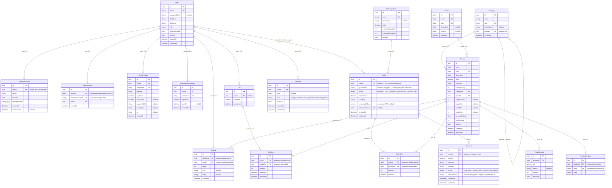

# Villi — B2C E-commerce Platform (Projects 1–2: Foundation + Commerce)

Villi is a Business-to-Consumer **curated marketplace for verified,
authenticated pre-loved Finnish/Nordic design high-end outdoor apparel** (e.g.
Fjällräven, Haglöfs, Luhta, Sasta, Norrøna, Klättermusen). This repository
implements **Project 1 — Foundation** (secure user accounts, an
ACID-compliant relational database, and a searchable, faceted product
catalog) and **Project 2 — Commerce** (guest + persistent carts, a
single-page checkout, real Stripe payments, async order/payment status via
RabbitMQ, and order management with cancellation + refunds). It's built
API-first and runs end-to-end with a single Docker command.

Because every item is **pre-loved and one-of-a-kind**, each listing carries an
authenticity status, a condition grade, and a size — all faceted attributes
buyers can filter on, with stock fixed at one unit per item.

> Project 3 (Experience — admin dashboards, accessibility & performance
> hardening) builds on top of this. See [Roadmap](docs/REFERENCE.md#roadmap).

## Table of contents

- [Quick start (for reviewers)](#quick-start-for-reviewers)
- [Troubleshooting](#troubleshooting)
- [Project overview](#project-overview)
- [Entity Relationship Diagram](#entity-relationship-diagram)
- [Setup and installation](#setup-and-installation)
- [Usage guide](#usage-guide)
- [Performance Analysis Report](#performance-analysis-report)
- [More documentation](#more-documentation) — tech stack, API reference, security, testing, review-criteria tables, project structure, roadmap

---

## Quick start (for reviewers)

**Prerequisite: Docker Desktop (running).** Nothing else to install.

```bash
git clone <this-repo>
cd i-love-shopping1
cp .env.example .env
```

**Before running `./start.sh`, set real credentials in `.env` for CAPTCHA,
OAuth, and Stripe** (see tables below), **and install the
[Stripe CLI](https://docs.stripe.com/stripe-cli)** — it's the one extra host
prerequisite alongside Docker (task2.txt: *"Docker and payment simulation
CLI are the only prerequisites"*). Without a real `STRIPE_SECRET_KEY`,
checkout fails outright at the payment step; without the CLI forwarding
webhooks, an otherwise-successful charge never flips `Order.status` off
`PENDING` — see [Payments and Stripe CLI setup](#payments-and-stripe-cli-setup)
below.

### CAPTCHA and OAuth

| Integration | Where to get credentials | `.env` variables |
|---|---|---|
| **Google reCAPTCHA** (registration form) | [google.com/recaptcha/admin/create](https://www.google.com/recaptcha/admin/create) — register a site as **reCAPTCHA v2 → "I'm not a robot" Checkbox** specifically (the widget calls `grecaptcha.render()`, which errors with "Invalid key type" on a v3 key), add `localhost` as an authorized domain | `RECAPTCHA_SECRET`, `VITE_RECAPTCHA_SITE_KEY` |
| **OAuth: Google** | [Google Cloud Console](https://console.cloud.google.com/apis/credentials) → Create Credentials → OAuth client ID (Web application) → add `GOOGLE_CALLBACK_URL`'s value as an authorized redirect URI | `GOOGLE_CLIENT_ID`, `GOOGLE_CLIENT_SECRET`, `VITE_GOOGLE_OAUTH_ENABLED=true` |
| **OAuth: GitHub** | [GitHub → Settings → Developer settings → OAuth Apps → New OAuth App](https://github.com/settings/developers) → set "Authorization callback URL" to `GITHUB_CALLBACK_URL`'s value | `GITHUB_CLIENT_ID`, `GITHUB_CLIENT_SECRET`, `VITE_GITHUB_OAUTH_ENABLED=true` |

Only **one** working OAuth provider is needed to satisfy the "email-password
+ OAuth" requirement — Google or GitHub, whichever is faster for you to
register.

### Payments and Stripe CLI setup

**Real Stripe test-mode keys are required** — checkout creates a real
`PaymentIntent` server-side, and the placeholder value in `.env.example`
isn't a working key (there's no such thing as a safe *shared* default for a
secret key, unlike a publishable key). Get free test-mode keys from
[dashboard.stripe.com/test/apikeys](https://dashboard.stripe.com/test/apikeys)
and set both in `.env`:

```
STRIPE_SECRET_KEY=sk_test_...
VITE_STRIPE_PUBLIC_KEY=pk_test_...
```

(`VITE_STRIPE_PUBLIC_KEY` needs `web` rebuilt after — `docker compose up -d --build web`.)

That covers creating the charge. The *confirmation* side needs one more
step: Stripe confirms the charge to the browser instantly, but our backend
only learns about it (and flips `Order.status` from `PENDING` to `PAID`,
sends the confirmation email, and publishes to RabbitMQ) via a **webhook**.
Locally, that means running the [Stripe CLI](https://docs.stripe.com/stripe-cli)
— install it, `stripe login` once, then:

```bash
stripe listen --forward-to localhost:8080/api/v1/checkout/webhook
```

Paste the `whsec_...` it prints into `STRIPE_WEBHOOK_SECRET` in `.env`, then
restart `api` (`docker compose up -d api`). Leave `stripe listen` running in
a separate terminal for the whole review session. Use Stripe's
[test cards](https://docs.stripe.com/testing#cards) to exercise specific
outcomes — `4242 4242 4242 4242` (success), `4000 0000 0000 9995`
(insufficient funds), `4000 0000 0000 0069` (expired card),
`4000 0000 0000 0002` (generic decline).

If `stripe listen` isn't running, checkout still completes and the order is
created — but the confirmation page will sit in "Confirming your payment…"
indefinitely (by design: it reflects real `Order.status`, it never fakes
success), since the webhook that would settle it never arrives.

```bash
./start.sh
```

On first run this generates a self-signed local HTTPS cert, builds and
starts every service (Postgres, Redis, RabbitMQ, Mailhog, API, web, proxy),
and applies migrations + seed data. (`start.sh` also copies `.env.example` →
`.env` automatically if you skip the `cp` step above)

Then open **http://localhost:8080** and sign in with a seeded account, or
register your own (email/password or OAuth) via **Sign up**:

| Role | Email | Password |
|---|---|---|
| Admin | `admin@villi.test` | `Admin!Passw0rd` |
| Customer | `shopper@villi.test` | `Shopper!Passw0rd` |

Accounts (email/password), catalog, 2FA, and password reset (via
[Mailhog](http://localhost:18025)) work with zero extra configuration.

## Troubleshooting

| Symptom | Fix |
|---|---|
| `permission denied ... docker.sock` | Your user was added to the `docker` group but the current shell predates it. Open a new terminal (or `wsl --shutdown` + reopen on Windows/WSL2), or run `newgrp docker` to refresh it in-place. |
| `api` container restart-looping, log shows `ENOENT ... certs/key.pem` | Delete the empty `certs/` dir if Docker auto-created it root-owned (`sudo rm -rf certs`), then re-run `./start.sh` — it regenerates the cert as your user. |
| API crashes with `RangeError: Invalid key length` | `ENCRYPTION_KEY` in `.env` must be exactly 32 bytes/characters. Regenerate: `openssl rand -hex 16`. |
| Port `3001`/`5173`/`8080` already in use | Set `API_HOST_PORT`/`WEB_HOST_PORT`/`PROXY_HOST_PORT` in `.env`, then re-run `./start.sh`. |

---

## Project overview

**Villi** is a B2C e-commerce platform for a curated pre-loved outdoor
apparel shop. Shoppers browse and search a product catalog, add items to a
cart that survives as a guest or a signed-in user, and check out through a
single-page flow with real Stripe payments, async order-status updates via
RabbitMQ, and full order management (filtering, cancellation, refunds). The
full admin UI is planned for Project 3.

| Capability | Summary |
|---|---|
| **Accounts & auth** | Email/password + OAuth (Google, GitHub), CAPTCHA on signup, JWT access + rotating refresh tokens, token revocation, password reset, optional TOTP 2FA. |
| **Database** | PostgreSQL (relational, ACID) via Prisma. Transactions for multi-step writes, FKs/constraints for integrity. |
| **Catalog** | Full product model, nested category browse, faceted search, sort by relevance/price/rating, static images. |
| **Cart** | Redis-backed guest cart (temporary, keyed by an anonymous id) + Postgres-backed persistent cart for signed-in users, merged automatically on login. Live totals, out-of-stock guards. |
| **Checkout & payments** | Single-page checkout (address + delivery + payment), prefilled for signed-in users. Stripe `PaymentElement` — card data never touches our backend. Order status (`PENDING`/`PAID`/`CANCELLED`) driven by a real Stripe webhook → RabbitMQ → consumer round-trip, with retry + dead-letter handling. |
| **Orders** | Filter by date/status, detailed order view, cancellation for unprocessed orders, real Stripe refunds, automatic inventory restock. |
| **API-first** | Versioned (`/api/v1`), documented with Swagger/OpenAPI, global validation, consistent error shape, per-IP rate limiting. |
| **Ops** | Fully containerized; one command builds + runs the whole stack. |
| **Business model** | **B2C** — Villi sells directly to individual consumers; see [B2C e-commerce model](docs/REFERENCE.md#b2c-e-commerce-model). |

Architecture, tech stack, and the full B2C-model writeup: [`docs/REFERENCE.md`](docs/REFERENCE.md).

---

## Entity Relationship Diagram

**Requirement:** An ERD showing **entities**, **attributes**, **relationships**,
**primary keys (PK)**, **foreign keys (FK)**, **cardinality**, and **modality**.

Source of truth: `backend/prisma/schema.prisma`.

### Diagram (Crow's foot notation)


```mermaid
erDiagram
  User ||--o| TwoFactorSecret : "has 0..1"
  User ||--o{ OAuthAccount : "links 0..N"
  User ||--o{ RefreshToken : "owns 0..N"
  User ||--o{ PasswordResetToken : "requests 0..N"
  User ||--o{ Review : "writes 0..N"

  Category ||--o{ Category : "parent 0..N children"
  Category ||--o{ Product : "contains 1..N"
  Brand ||--o{ Product : "makes 1..N"
  Product ||--o{ ProductImage : "has 1..N"
  Product ||--o{ ProductAttribute : "has 0..N"
  Product ||--o{ Review : "receives 0..N"

  User ||--o{ Cart : "owns 0..N"
  Cart ||--o{ CartItem : "contains 0..N"
  Product ||--o{ CartItem : "in 0..N"
  User ||--o{ Address : "saves 0..N"

  User ||--o{ Order : "places 0..N (nullable — guest orders have no user)"
  DeliveryOption ||--o{ Order : "ships 0..N"
  Order ||--o{ OrderItem : "contains 1..N"
  Product ||--o{ OrderItem : "in 0..N"
  Order ||--o| Payment : "has 0..1"

  User {
    uuid id PK
    string email UK
    string passwordHash "nullable"
    string firstName
    string lastName
    enum role
    bool isEmailVerified
    bool isActive
    datetime createdAt
    datetime updatedAt
  }
  TwoFactorSecret {
    uuid id PK
    uuid userId FK "unique, one row per user"
    string secret
    bool enabled
    string_array recoveryCodes
    datetime createdAt
    datetime confirmedAt "nullable"
  }
  OAuthAccount {
    uuid id PK
    enum provider UK "composite with providerAccountId"
    string providerAccountId UK "composite with provider"
    uuid userId FK
    datetime createdAt
  }
  RefreshToken {
    uuid id PK
    uuid userId FK
    string tokenHash UK
    string familyId
    datetime expiresAt
    datetime revokedAt "nullable"
    string replacedById "nullable"
    string userAgent "nullable"
    string ip "nullable"
    datetime createdAt
  }
  PasswordResetToken {
    uuid id PK
    uuid userId FK
    string tokenHash UK
    datetime expiresAt
    datetime usedAt "nullable"
    datetime createdAt
  }
  Category {
    uuid id PK
    string name
    string slug UK
    string description "nullable"
    uuid parentId FK "nullable self"
    datetime createdAt
  }
  Brand {
    uuid id PK
    string name UK
    string slug UK
    string description "nullable"
    string logoUrl "nullable"
    datetime createdAt
  }
  Product {
    uuid id PK
    string name
    string slug UK
    string description
    decimal price
    string currency
    int stockQuantity
    uuid categoryId FK
    uuid brandId FK
    int weightGrams "nullable"
    int lengthMm "nullable"
    int widthMm "nullable"
    int heightMm "nullable"
    float averageRating
    int ratingCount
    bool isActive
    datetime createdAt
    datetime updatedAt
  }
  ProductImage {
    uuid id PK
    uuid productId FK
    string url
    string altText "nullable"
    int position
    bool isPrimary
  }
  ProductAttribute {
    uuid id PK
    uuid productId FK "composite with name"
    string name UK "composite with productId"
    string value
  }
  Review {
    uuid id PK
    uuid productId FK "composite with userId"
    uuid userId FK "composite with productId"
    int rating
    string title "nullable"
    string body "nullable"
    datetime createdAt
  }
  Cart {
    uuid id PK
    uuid userId FK "nullable"
    datetime createdAt
    datetime updatedAt
  }
  CartItem {
    uuid id PK
    uuid cartId FK "composite with productId"
    uuid productId FK "composite with cartId"
    int quantity
    datetime createdAt
    datetime updatedAt
  }
  Address {
    uuid id PK
    uuid userId FK
    string label "nullable"
    string data "encrypted JSON: street/city/postalCode/country/phone"
    bool isDefault
    datetime createdAt
    datetime updatedAt
  }
  DeliveryOption {
    uuid id PK
    string name UK
    string description "nullable"
    decimal price
    int estimatedDaysMin
    int estimatedDaysMax
    bool isActive
  }
  Order {
    uuid id PK
    uuid userId FK "nullable — null for guest checkouts"
    string guestEmail "nullable, encrypted — set only for guest checkouts"
    enum status "PENDING | PAID | SHIPPED | DELIVERED | CANCELLED"
    decimal totalAmount
    string currency
    string shippingAddress "encrypted JSON, nullable"
    uuid deliveryOptionId FK "nullable"
    datetime createdAt
    datetime updatedAt
  }
  OrderItem {
    uuid id PK
    uuid orderId FK "composite with productId"
    uuid productId FK "composite with orderId"
    int quantity
    decimal unitPrice
  }
  Payment {
    uuid id PK
    uuid orderId FK "unique, one row per order"
    decimal amount
    string currency
    string provider
    enum status "PENDING | COMPLETED | FAILED | REFUNDED"
    string transactionId "nullable, encrypted — Stripe PaymentIntent id"
    datetime createdAt
    datetime updatedAt
  }
```

### Notation legend

| Symbol / term | Meaning |
|---------------|---------|
| **PK** | Primary key — unique row identifier (`@id` in Prisma) |
| **FK** | Foreign key — references another entity's PK (`@relation`) |
| **UK** | Alternate unique key (`@unique` or `@@unique`) |
| **Cardinality** | Maximum multiplicity on each side (one vs many), shown on diagram edges |
| **Modality** | Minimum participation (optional `0` vs mandatory `1`) |

**Mermaid edge cheat sheet:** `\|\|--o\|` = 1 : 0..1 (child optional, at most one) · `\|\|--o{` = 1 : 0..N (child optional, many) · `\|\|--\|{` = 1 : 1..N (child mandatory, many).

### Relationships (cardinality + modality + FK)

| Relationship | Cardinality | Modality | Foreign key |
|--------------|-------------|----------|-------------|
| User → TwoFactorSecret | 1 : 0..1 | 2FA optional; if present, exactly one row per user | `TwoFactorSecret.userId` → `User.id` |
| User → OAuthAccount | 1 : 0..N | OAuth optional; user may link multiple providers | `OAuthAccount.userId` → `User.id` |
| User → RefreshToken | 1 : 0..N | Zero or many active/historical sessions | `RefreshToken.userId` → `User.id` |
| User → PasswordResetToken | 1 : 0..N | Zero or many reset requests over time | `PasswordResetToken.userId` → `User.id` |
| User → Review | 1 : 0..N | Shoppers may write zero or many reviews | `Review.userId` → `User.id` |
| Category → Category (tree) | 1 : 0..N | Root categories have `parentId` null | `Category.parentId` → `Category.id` |
| Category → Product | 1 : 0..N | Each product in exactly one category | `Product.categoryId` → `Category.id` |
| Brand → Product | 1 : 0..N | Each product has one brand | `Product.brandId` → `Brand.id` |
| Product → ProductImage | 1 : 0..N | Images optional; usually one or more | `ProductImage.productId` → `Product.id` |
| Product → ProductAttribute | 1 : 0..N | Facets optional (condition, size, colour) | `ProductAttribute.productId` → `Product.id` |
| Product → Review | 1 : 0..N | Reviews optional; aggregates on `Product` | `Review.productId` → `Product.id` |
| User → Cart | 1 : 0..N | Guest carts have null userId | `Cart.userId` → `User.id` |
| Cart → CartItem | 1 : 0..N | Carts contain zero or many items | `CartItem.cartId` → `Cart.id` |
| Product → CartItem | 1 : 0..N | Product can be in multiple carts | `CartItem.productId` → `Product.id` |
| User → Address | 1 : 0..N | Saved address book; zero or many per user | `Address.userId` → `User.id` |
| User → Order | 1 : 0..N | `userId` is nullable — guest checkouts have no user, identified by `guestEmail` instead | `Order.userId` → `User.id` |
| DeliveryOption → Order | 1 : 0..N | Nullable; `SetNull` if the option is later removed | `Order.deliveryOptionId` → `DeliveryOption.id` |
| Order → OrderItem | 1 : 1..N | Orders must contain at least one item | `OrderItem.orderId` → `Order.id` |
| Product → OrderItem | 1 : 0..N | Product can be in multiple orders | `OrderItem.productId` → `Product.id` |
| Order → Payment | 1 : 0..1 | At most one payment record per order | `Payment.orderId` → `Order.id` |

ACID/transaction notes and DB scalability rationale: [`docs/REFERENCE.md`](docs/REFERENCE.md#acid-properties-in-e-commerce).

---

## Setup and installation

Covered in full in [Quick start](#quick-start-for-reviewers) above — Docker,
`.env` setup, CAPTCHA/OAuth, and the Stripe CLI webhook step. Two more `.env`
values worth knowing about even though the defaults work out of the box:

- `ENCRYPTION_KEY` — AES-256-GCM key for encrypted user fields, **must be
  exactly 32 characters**. The example value works for local dev; generate a
  real one with `openssl rand -hex 16`. Changing it after data exists makes
  that data unrecoverable.
- `JWT_ACCESS_SECRET` / `JWT_REFRESH_SECRET` — the `.env.example` defaults
  are fine for local dev; replace with `openssl rand -hex 48` for any
  shared/public deployment.


**Without Docker:** Node 20+, PostgreSQL, Redis, and RabbitMQ running locally
(the payment/order-status queue needs it — checkout works without Docker
only if RabbitMQ is reachable at `RABBITMQ_URL`), then:
```bash
cd backend && npm install && cp ../.env.example .env  # adjust DATABASE_URL/REDIS_URL
npx prisma migrate deploy && npm run prisma:seed && npm run start:dev  # :3001
cd ../frontend && npm install && npm run dev                          # :5173
```

---

## Usage guide

After [setup](#quick-start-for-reviewers), open **http://localhost:8080** and
sign in with a seeded account.

1. **Browse & search** — type-ahead search, facet filters (category, price,
   brand, rating, size, condition), sort by relevance/price/rating/newest.
2. **Reviews & ratings** — read reviews on any product; signed-in users can
   leave a 1–5 star review (one per product). Ratings are computed live.
3. **Register / sign in** — email+password or OAuth; CAPTCHA shown if
   configured. Access token lives only in memory, never localStorage.
4. **Account page** — enable/disable optional TOTP 2FA, export data, save
   addresses, or delete your account (GDPR).
5. **Admin** — sign in as admin to manage products/categories/brands.

### Cart, checkout & payments

6. **Cart** — add items from any product page or the shop grid; the cart
   icon shows a live count. Update quantities or remove items directly in
   the cart drawer — totals recalculate immediately. Adding more than the
   current stock is rejected with an explicit "only N in stock" message,
   not a silent clamp. **As a guest**, the cart is kept in Redis under an
   anonymous id stored in `localStorage`; sign in and it merges automatically
   into your persistent (Postgres-backed) cart, capped at each product's
   current stock.
7. **Checkout** — one page: shipping address (street/city/postal
   code/country/phone, validated both client- and server-side), a shipping
   option, and payment. Signed-in users get their email and default saved
   address prefilled. The order summary stays editable (quantity/remove)
   until you place the order.
8. **Payment** — Stripe's `PaymentElement` renders inline; your card number
   never reaches our backend. Use any [Stripe test card](https://docs.stripe.com/testing#cards)
   to see a specific outcome (success, insufficient funds, expired card,
   generic decline). **Requires real `STRIPE_SECRET_KEY`/`VITE_STRIPE_PUBLIC_KEY`
   in `.env` and `stripe listen` running** — see
   [Payments and Stripe CLI setup](#payments-and-stripe-cli-setup).
9. **Order confirmation** — after payment, the page polls briefly and shows
   one of three real states: a green confirmation once `Order.status` is
   `PAID`, an honest "confirming your payment…" while the webhook is still
   in flight, or a clear failure screen if the charge was declined — never a
   false "success" before the backend has actually confirmed it.
10. **My orders** — filter by date range and status; open an order for full
    details (items, address, payment status, delivery estimate). Cancel any
    order that's still `PENDING` or `PAID`; cancelling a `PAID` order issues
    a real Stripe refund and restocks inventory automatically.

**Quick reviewer walkthrough:**

| Step | Action |
|------|--------|
| 1 | `./start.sh -d` — wait until API, web, and proxy are up |
| 2 | In a separate terminal: `stripe listen --forward-to localhost:8080/api/v1/checkout/webhook` |
| 3 | Open **http://localhost:8080** — browse catalog, use facets and sort |
| 4 | Add a product to cart as a guest, then sign in — watch it merge |
| 5 | Sign in as `shopper@villi.test` / `Shopper!Passw0rd` |
| 6 | Check out with test card `4242 4242 4242 4242` → confirmation page flips to PAID within a couple seconds |
| 7 | Try `4000 0000 0000 9995` (insufficient funds) on a second order — watch the order end up `CANCELLED` and stock revert |
| 8 | My Orders → open the paid order → Cancel → confirm the refund + restock |
| 9 | Account → optional 2FA; API docs at http://localhost:3001/api/docs |
| 10 | Run tests: `docker compose --profile test run --rm e2e` |

**Password reset demo:** Forgot password → enter an email → open
[Mailhog](http://localhost:18025) for the reset link → set a new password.
Order confirmation / payment-failed emails land in Mailhog the same way.

For more detailed review:
- [`docs/review-guide-part-1.md`](docs/review-guide-part-1.md) — step-by-step
  walkthroughs for every task1.txt checklist item.

---

## Performance Analysis Report

- **Database & queries** — Redis caches catalog responses and facet
  aggregations to reduce Postgres load; B-Tree indexes on slugs, category
  lookups, and FKs keep nested-relation queries low-latency; high-concurrency
  writes run inside Prisma `$transaction` blocks for row-level consistency
  without heavy table locking.
- **Assets & frontend** — Vite code-splits the bundle so admin-only screens
  don't block initial load; static images are served as WebP with
  long-lived cache headers (`Cache-Control: public, max-age=31536000`) via
  nginx for fast LCP; CSS layout adapts via `minmax()` to avoid reflows.
- **Security & scalability overhead** — rate limiting uses a Redis-backed
  token-bucket (`common/throttler/token-bucket-throttler.storage.ts`, atomic
  via Lua script) so state is consistent across API replicas; JWTs are
  stateless, so horizontal scaling adds no per-request lookup cost. Real
  throughput/latency numbers: [`docs/load_test_report.md`](docs/load_test_report.md).

---

## More documentation

- [`docs/REFERENCE.md`](docs/REFERENCE.md) — tech stack, architecture, full
  API reference, security model, testing details, per-criterion review
  tables (auth, CAPTCHA/2FA, catalog, B2C/ERD), manual test checklist,
  project structure, roadmap, bonus features, and oral-exam talking points.
- [`docs/review-guide-part-1.md`](docs/review-guide-part-1.md) — step-by-step
  walkthroughs for every task1.txt checklist item.
- [`docs/load_test_report.md`](docs/load_test_report.md) — load test results.
