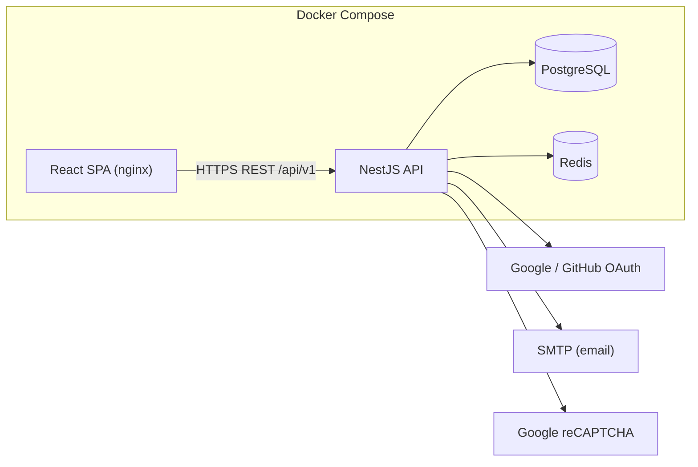

# Villi — Reference & review material

Deeper detail that supports the [README](../README.md) but isn't required reading
to run or review the app: architecture, full API reference, security model,
testing, per-criterion review tables, and oral-exam talking points.

## Table of contents

- [Tech stack](#tech-stack)
- [Architecture](#architecture)
- [B2C e-commerce model](#b2c-e-commerce-model)
- [Database scalability & growth](#database-scalability--growth)
- [ACID properties in e-commerce](#acid-properties-in-e-commerce)
- [API reference](#api-reference)
- [Security model](#security-model)
- [Testing](#testing)
- [Review criteria (task1)](#review-criteria-task1)
- [Manual test checklist](#manual-test-checklist)
- [Project structure](#project-structure)
- [Roadmap](#roadmap)
- [Bonus features](#bonus-features)
- [Oral-exam talking points](#oral-exam-talking-points)

---

## Tech stack

- **Backend:** NestJS 11 (TypeScript), Prisma 6, Passport, `@nestjs/jwt`, argon2, otplib, Helmet, `@nestjs/throttler`.
- **Frontend:** React 18 + Vite + React Router (served by nginx in production).
- **Database:** PostgreSQL 16. **Cache / token store:** Redis 7.
- **Tooling:** ESLint, Prettier, Jest + Supertest, Docker / Docker Compose.

## Architecture



**Modular monolith:** one deployable API split into feature modules (`auth`,
`users`, `catalog`) plus shared infrastructure modules (`prisma`, `redis`,
`mail`) — simple to run, with clean seams to extract services later.

## B2C e-commerce model

Villi is a **single-store B2C** marketplace: one business operates the catalog
and sells **to end consumers**, not to other businesses.

| B2C characteristic | How Villi implements it |
|--------------------|-------------------------|
| Customers are consumers | Shoppers register with role `USER`; no business/wholesaler accounts. |
| Business → Consumer flow | Platform-managed catalog; no multi-vendor seller portal or B2B pricing. |
| Public storefront | React SPA: search, facets, product detail, reviews — for individual buyers. |
| Curated retail positioning | Pre-loved, one-of-a-kind items; `stockQuantity` is typically **1** per listing. |
| Consumer accounts | `User` for shoppers, `ADMIN` for platform staff — no "merchant" entity. |

**Out of scope by design:** B2B wholesale, seller onboarding, corporate
billing, multi-tenant vendor stores (arrives, if ever, in a later project).

## Database scalability & growth

PostgreSQL supports Villi's growth via:
- **Vertical scaling** — the single primary instance scales with CPU/RAM.
- **Read replicas** — async streaming replication offloads catalog reads (searches, product views) from the write-heavy primary.
- **Connection pooling** (PgBouncer / Prisma Accelerate) for high concurrent shopper traffic.
- **Indexing** — B-Tree for lookups/FKs, GIN/GiST for attribute/JSON search, keeping faceted search fast as the catalog grows.
- **Redis caching** in front of Postgres for catalog results, facet aggregations, and type-ahead — absorbs traffic spikes.

## ACID properties in e-commerce

ACID guarantees prevent catastrophic e-commerce failures (overselling, lost orders):
- **Atomicity** — placing an order (create order → create payment → clear cart → deduct stock) is one indivisible unit; any step failing rolls back all of it.
- **Consistency** — FKs and typed columns (`Decimal` for prices) keep the DB in a valid state.
- **Isolation** — concurrent buyers of the last unit of a product can't both succeed; the second fails gracefully instead of overselling.
- **Durability** — once a transaction commits, it survives a crash immediately after.

Multi-step operations (OAuth linking, refresh rotation, password reset +
session revocation, product creation, review + rating recompute) run inside
Prisma `$transaction`s.

---

## API reference

Base URL: `http://localhost:3001/api/v1`. Full interactive docs at `/api/docs`.

**Auth**
| Method | Path | Description |
|---|---|---|
| POST | `/auth/register` | Register (email/password, CAPTCHA) |
| POST | `/auth/login` | Login; returns access token (+ refresh cookie) |
| POST | `/auth/refresh` | Rotate refresh token, get new access token |
| POST | `/auth/logout` | Revoke current refresh + access token |
| POST | `/auth/forgot-password` / `/auth/reset-password` | Password reset |
| GET/POST | `/auth/2fa/status\|setup\|enable\|disable` | Manage TOTP 2FA |
| GET | `/auth/oauth/google\|github` | Start OAuth flow |

**Users**
| Method | Path | Description |
|---|---|---|
| GET | `/users/me` | Current profile |
| GET | `/users/me/export` | GDPR data export |
| DELETE | `/users/me` | GDPR account deletion |

**Catalog**
| Method | Path | Description |
|---|---|---|
| GET | `/products` | Faceted search + sort + pagination |
| GET | `/products/suggest?q=` | Type-ahead suggestions |
| GET | `/products/facets` | Facet values + counts for current filters |
| GET | `/products/:idOrSlug` | Product detail |
| POST/PATCH/DELETE | `/products[/:id]` | Admin product management |
| GET/POST | `/products/:idOrSlug/reviews` | List / create-update review |
| DELETE | `/products/:idOrSlug/reviews/mine` | Delete your own review (auth) |
| GET | `/categories`, `/categories/tree` | Browse categories |
| GET | `/brands` | List brands |

**Example — faceted search:**
```
GET /api/v1/products?q=jacket&category=shell-jackets&brands=fjallraven&brands=haglofs\
&minPrice=100&maxPrice=300&minRating=4&attributes=size:M&attributes=condition:Very Good&sort=price_asc&page=1&limit=20
```

## Security model

- **Passwords** hashed with **argon2**; rules enforced server-side.
- **CAPTCHA** (Google reCAPTCHA) verified server-side on registration.
- **Access tokens** short-lived (15m default), kept **in memory only** on the SPA (never localStorage).
- **Refresh tokens** long-lived (7d default), opaque, stored as a SHA-256 hash, delivered as an **httpOnly, SameSite** cookie scoped to `/api/v1/auth`.
- **Rotation:** every refresh issues a new token and invalidates the old one; reuse of a rotated token revokes the whole token **family**.
- **Revocation:** logout revokes the refresh token and denylists the access token's `jti` in Redis.
- **2FA:** optional TOTP with hashed single-use recovery codes.
- **Transport/headers:** Helmet, strict CORS, global input validation with unknown-field stripping.
- **Rate limiting:** per-IP globally, tighter on auth-sensitive endpoints.
- **Injection safety:** Prisma parameterizes all queries.
- **GDPR:** data export + account erasure; no user-enumeration on login/reset.

---

## Testing

Frameworks: **Jest** (+ ts-jest) for unit tests, **Supertest** for API integration/security tests.

**Run everything via Docker** (throwaway DB, no host ports needed):
```bash
docker compose --profile test run --rm e2e
```

**Or run pieces locally** (Node 20+):
```bash
cd backend
npm test          # unit tests, no DB required
npm run test:cov  # unit tests with coverage
npm run test:e2e  # API integration + security tests (needs DB + Redis)
```

**Unit tests (34)** cover JWT token handling incl. rotation/reuse-detection
(`auth/tokens.service.spec.ts`), auth DTO validation incl. injection-style
input (`auth/dto/auth.dto.spec.ts`), CAPTCHA skip/enforce logic
(`auth/captcha.service.spec.ts`), and the product data model + dimension
conversion (`catalog/dto/product.dto.spec.ts`, `catalog/products.service.spec.ts`,
`common/utils/units.spec.ts`).

**API integration + security tests (32, `test/app.e2e-spec.ts`)** cover catalog
listing/facets/sorting, reviews (auth-gated create, rating validation,
aggregate recompute, owner delete), auth (register/login/persistence),
refresh-token rotation + reuse detection, logout revocation, and security
cases (malformed input, SQLi-as-data, injection in path params, admin guards).

## Review criteria (task1)

Each row: criterion → where it's implemented → how to demonstrate it live.

**Auth**

| Criterion | Where | Demonstrate |
|-----------|-------|-------------|
| Email-password + OAuth | `POST /auth/register`, `/auth/login`; `GET /auth/oauth/google\|github` + callbacks; `findOrCreateFromOAuth()` links providers to existing emails | Register/sign in with email. For OAuth: set `GOOGLE_*`/`GITHUB_*` + `VITE_*_OAUTH_ENABLED=true` in `.env`, rebuild `web`. |
| Access token in memory | `frontend/src/api/client.ts` module variable, never localStorage | DevTools → Local Storage: no token present. |
| Refresh rotation (single-use) | `backend/src/auth/tokens.service.ts` `rotate()` | Call `/auth/refresh` twice with the same cookie — second call is 401. |
| Revocation (access + refresh) | Redis denylist by `jti` + refresh revocation on logout | After logout, old bearer token → 401. |
| Password reset via email | `/auth/forgot-password`, `/auth/reset-password`; caught by Mailhog | http://localhost:18025 |
| Client + server validation | `frontend/src/utils/validation.ts` + server DTOs/`ValidationPipe` | Submit invalid fields → inline errors; server still 400s if bypassed. |

**CAPTCHA & 2FA**

| Criterion | Where | Demonstrate |
|-----------|-------|-------------|
| CAPTCHA on registration | `Recaptcha.tsx`; `CaptchaService.verify()` | With keys set: widget blocks submit until checked. Without: skipped server-side (dev). |
| Optional user-enabled 2FA | `/account` → Enable 2FA; `two-factor.service.ts` | Enable → sign out → login prompts for a 6-digit code. |

**Catalog**

| Criterion | Where | Demonstrate |
|-----------|-------|-------------|
| Full product model | `Product`/`ProductImage` + `ProductsService.toPublic()` | `GET /products?limit=1` — id, price, stock, category, brand, images, dimensions. |
| Categories / browsing | Nested `Category` tree, `GET /categories/tree` | Pick a subcategory — listing updates. |
| Faceted search | `GET /products` + `/products/facets` | Filter by brand, price, rating, attributes. |
| Sorting | relevance / price / rating / newest | Sort dropdown on catalog. |
| Product images | `frontend/public/products/*.png` served via nginx | Images on cards. |

**B2C & ERD**

| Criterion | Where |
|-----------|-------|
| B2C model | Consumer `USER` role, platform-operated catalog, no B2B entities — see [B2C e-commerce model](#b2c-e-commerce-model). |
| Full ERD | [README → Entity Relationship Diagram](../README.md#entity-relationship-diagram) — entities/attributes/PK/FK + cardinality/modality table, matches `prisma/schema.prisma`. |

Full step-by-step walkthroughs: [`docs/review-guide-part-1.md`](review-guide-part-1.md).

## Manual test checklist

Guards against flows that are hard to fully automate:

- [ ] **CAPTCHA** — with `RECAPTCHA_SECRET`/`VITE_RECAPTCHA_SITE_KEY` set, registration shows the widget and fails server-side without a valid token.
- [ ] **OAuth (Google / GitHub / Facebook)** — "Continue with…" completes and lands signed-in, linking/creating the account.
- [ ] **2FA setup** — enable on Account, scan the QR, verify a code, confirm recovery codes shown once.
- [ ] **2FA login** — sign out/in; confirm the code prompt and that a recovery code works as fallback.

---

## Project structure

```
.
├── proxy/nginx.conf          # unified gateway (/ → web, /api → api)
├── scripts/                  # ngrok tunnel + cert-recovery helper scripts
├── docker-compose.yml        # postgres + redis + api + web + proxy
├── start.sh                  # one-command build & run
├── .env.example               # all configuration (12-factor)
├── backend/                  # NestJS API
│   ├── prisma/               # schema, migrations, seed
│   └── src/
│       ├── auth/             # auth, JWT, OAuth, 2FA, captcha
│       ├── users/            # profile + GDPR
│       ├── catalog/          # products, categories, brands, search
│       ├── common/           # guards, filters, decorators, utils
│       ├── prisma|redis|mail/# infrastructure modules
│       └── main.ts           # bootstrap (Swagger, validation, security)
└── frontend/                 # React + Vite SPA (nginx in prod)
    └── src/{api,auth,components,pages}
```

## Roadmap

- **Project 2 — Commerce:** cart, checkout, payment integration, order lifecycle. Reuses Foundation auth + catalog; adds transactional stock decrement (`SELECT ... FOR UPDATE`) on order placement.
- **Project 3 — Experience:** full customer UI, admin dashboards, WCAG 2.1 Level A accessibility, performance/production hardening.

## Bonus features

- Refresh-token **family reuse detection** (theft mitigation).
- Redis-backed **access-token revocation** denylist.
- **Faceted** filtering with live counts + attribute facets.
- **Reviews & ratings** — aggregates recomputed transactionally from real rows.
- **Client + server validation** with inline, accessible (`aria-invalid`) errors.
- **Verified-authentic** + **condition** trust badges.
- Dual **metric/imperial** product dimensions.
- **GDPR** data export & erasure endpoints.

## Oral-exam talking points

[`docs/review-guide-part-1.md`](review-guide-part-1.md) answers every
`task1.txt` checklist item with a code reference and a demonstration, including:

- **JWT** — header/payload/signature, token lifecycle, live claim structure.
- **ACID** — walk a Prisma `$transaction` for checkout stock deduction / token rotation.
- **Architecture** — why modular monolith for Foundation; extraction path to microservices.
- **Scalability** — indexes, Redis cache, horizontal API replicas.
- **Search** — `buildWhere()` walkthrough, Postgres `ILIKE`, facet counts.
- **Testing** — unit vs e2e strategy, how to run and demo each suite live.
