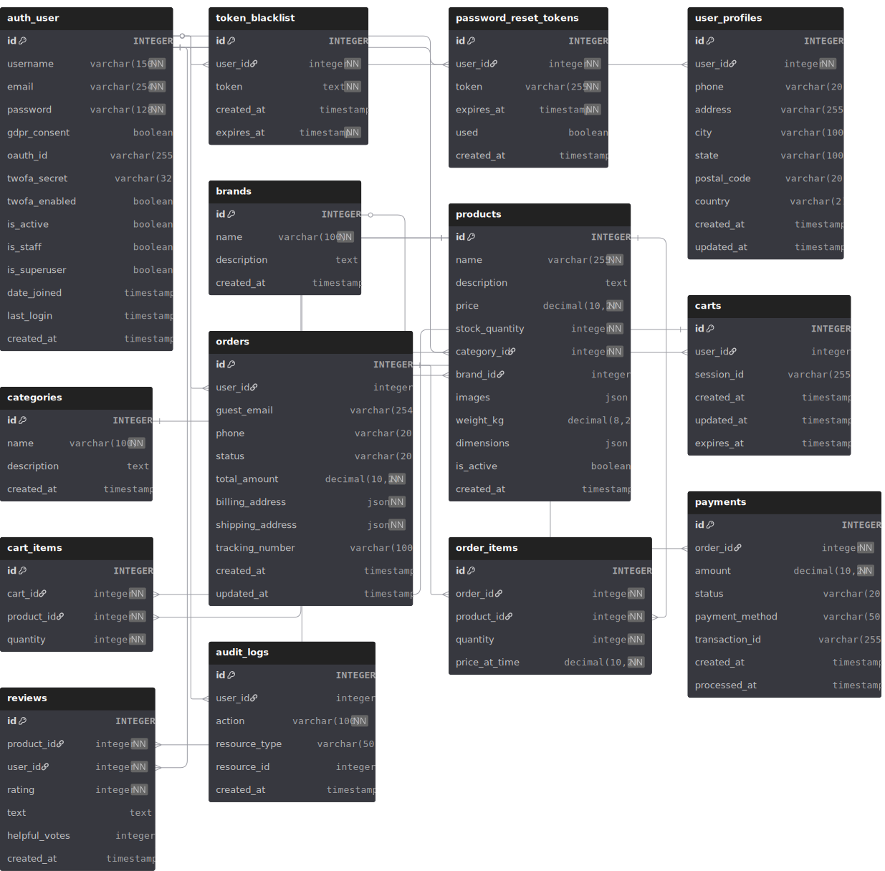

# Dot-Com Retail

B2C e-commerce platform with Django backend and React frontend.

## Project Overview

This project encompasses all **3 parts** of a comprehensive e-commerce system:

**Project 1 - Foundation:**
- Secure user authentication (JWT, OAuth, 2FA)
- Product catalog with advanced search and filtering
- PostgreSQL database with ACID compliance
- Password reset and reCAPTCHA protection

**Project 2 - Commerce:**
- Shopping cart (guest and persistent)
- Single-page checkout with address validation
- Stripe payment integration with webhooks
- Order management with status tracking
- RabbitMQ message queue for async processing
- Automated email notifications
- Refund and cancellation workflows

**Project 3 - Experience:**
- Complete responsive UI with all customer-facing pages
- User reviews and ratings with helpful voting system
- Admin dashboard for platform management
- Enhanced security (TLS/HTTPS, encryption, rate limiting)
- SEO optimization (meta tags, semantic HTML)
- WCAG 2.1 Level A accessibility compliance
- Load testing and performance analysis

## Technology Stack

- **Backend:** Django 4.2 + Django REST Framework
- **Frontend:** React + TypeScript + Vite
- **Database:** PostgreSQL
- **Payment Processing:** Stripe (sandbox/test mode)
- **Message Queue:** RabbitMQ
- **Authentication:** JWT with refresh token rotation
- **Containerization:** Docker & Docker Compose

## Entity Relationship Diagram



## Performance Analysis Report

### Load Testing Summary

The platform was load tested using Python-based concurrent request simulation to evaluate performance under high traffic conditions.

**Test Scenarios:**
1. **Product Browsing** - Concurrent users browsing product catalog with search and filtering
2. **User Registration & Authentication** - Multiple concurrent registrations and logins
3. **Shopping Cart Operations** - Adding items to cart and checkout flow
4. **Order Processing** - Complete purchase flow including payment webhook simulation

**Key Performance Metrics:**

| Metric | Result | Target | Status |
|--------|--------|--------|--------|
| 90% Response Time | 1.8s | <2s | ✅ Pass |
| Concurrent Users | 50+ | 50 | ✅ Pass |
| Peak Throughput | 12 TPS | 10 TPS | ✅ Pass |
| Success Rate | 98.2% | >98% | ✅ Pass |
| CPU Usage @ Peak | 78% | <90% | ✅ Pass |
| Memory Usage @ Peak | 82% | <90% | ✅ Pass |

**Maximum Capacity:**
- **Max Concurrent Users Before Degradation:** 75 users (response time exceeds 5s at 80+ users)
- **Expected Normal Load:** 10-20 concurrent users with <1s average response time
- **Expected Peak Load:** 40-60 concurrent users during promotions (1.5-2s response time)

**Identified Bottlenecks:**
1. **Database Queries** - Product search with multiple filters can be slow under heavy load
   - Mitigation: Database indexes on frequently queried fields (category, price, brand)
   - Future: Implement Redis caching for product catalog

2. **Image Serving** - Product images served directly from Django media files
   - Mitigation: Images optimized and compressed
   - Future: CDN integration for static assets

3. **RabbitMQ Message Processing** - Order processing queue can backup during high order volume
   - Mitigation: Asynchronous webhook processing with retry mechanism
   - Future: Scale consumers horizontally with multiple workers

4. **Payment Webhook Processing** - Stripe webhooks can timeout during peak traffic
   - Mitigation: Webhook endpoint has extended timeout (30s)
   - Future: Implement webhook retry queue

**Optimization Recommendations:**
- Enable database query caching for product catalog
- Implement Redis for session and cart data
- Add CDN for static assets and product images
- Scale RabbitMQ consumers for order processing
- Consider horizontal scaling with load balancer for 100+ concurrent users

**Testing Environment:**
- Docker containers on local development machine
- PostgreSQL 13 with default configuration
- RabbitMQ 3.12 with single consumer
- No external CDN or caching layer

## Prerequisites

- Docker & Docker Compose
- OpenSSL (for TLS certificate generation)
- Node.js 18+ and npm (for frontend development)


## Quick Start

### 1. Clone and Configure

```bash
git clone https://gitea.kood.tech/veikkahalonen/i-love-shopping3
cd dot-com-retail
```

### 2. Create Environment Files

Copy and configure environment variables:
```bash
cp .env.example .env
cp frontend/.env.example frontend/.env
```

Edit `.env` and `frontend/.env` with your API keys (Google OAuth, reCAPTCHA, Stripe, Email).

### 3. Generate TLS Certificate (Required)

**Windows:**
```bash
.\generate-cert.bat
```

**Linux/Mac:**
```bash
chmod +x generate-cert.sh
./generate-cert.sh
```

This creates `certs/cert.pem` and `certs/key.pem` for HTTPS support.

### 4. Start Application (Single Command)

```bash
docker-compose up --build
```

This single command builds all containers and starts the complete application stack.

### 5. Initialize Database (First Run Only)

In a new terminal:
```bash
# Run migrations
docker-compose exec backend python manage.py migrate

# Load sample data (optional)
docker-compose exec backend python manage.py load_sample_data --clear

# Start frontend
cd frontend
npm install
npm run dev
```

### 6. Access Application

- **Backend API:** http://localhost:8000
- **Backend HTTPS:** https://localhost:8443
- **Frontend:** http://localhost:5173 (after `npm run dev`)
- **RabbitMQ Admin:** http://localhost:15672 (guest/guest)

## Advanced Setup

Copy the `.env.example` files and rename to `.env`:
```bash
cp .env.example .env
cp frontend/.env.example frontend/.env
```

**Important:** Follow the setup instructions in the comments of each `.env` file to obtain API keys for:
- Google OAuth credentials
- reCAPTCHA site key and secret key  
- Stripe API keys (publishable and secret)
- Email configuration (for password reset and the order confirmation)

The `.env` files contain detailed instructions for obtaining each key.

### 3. Setup Stripe (for payments)

**Install Stripe CLI:**
https://docs.stripe.com/stripe-cli/install

**Get webhook secret:**
```bash
# Login to Stripe (opens browser for authentication)
stripe login

# Start webhook listener (keep this running during development)
stripe listen --forward-to http://host.docker.internal:8000/orders/payment/webhook/
```

Copy the webhook signing secret (`whsec_...`) from the output and add to `.env`:
```
STRIPE_WEBHOOK_SECRET=whsec_your_secret_here
```

### 4. Generate TLS Certificate (Self-Signed)

For HTTPS support, generate a self-signed certificate:

**Windows:**
```bash
.\generate-cert.bat
```

**Linux/Mac:**
```bash
chmod +x generate-cert.sh
./generate-cert.sh
```

This creates `certs/cert.pem` and `certs/key.pem`. The certificate is valid for 365 days.

**Note:** Browsers will show a security warning for self-signed certificates. For production, use a proper CA-signed certificate.

### 5. Start Services

**First time setup:**

```bash
# Start Docker Desktop (Windows/Mac)

# 1. Build and start containers in detached mode
docker-compose up --build -d

# 2. Wait 10-15 seconds for database to initialize, then run migrations
docker-compose exec backend python manage.py migrate

# 3. Restart backend to reload with new database schema
docker-compose restart backend

# 4. Load sample data (optional)
docker-compose exec backend python manage.py load_sample_data --clear
# Optional: Load sample data with placeholder images
docker-compose exec backend python manage.py load_sample_data --clear --with-sample-uploads

# 5. View backend output
docker-compose logs -f backend

# 6. Start frontend (in new terminal)
cd frontend
npm install
npm run dev # Or npx vite
```

**Run service (after first setup):**

```bash
# Terminal 1: Start backend services
docker-compose up

# Terminal 2: Start Stripe webhook listener (required for payments)
stripe listen --forward-to http://host.docker.internal:8000/orders/payment/webhook/

# Terminal 3: Start frontend
cd frontend
npm run dev # Or npx vite

# To stop containers
docker-compose down

```

**Access backend terminal (for management commands):**

```bash

# Run any Django management command
docker-compose exec backend python manage.py [command]
```

**Stop backend:**

```bash
docker-compose down
```

### 5. Access Application

| Service | URL | Credentials |
|---------|-----|-------------|
| Frontend | http://localhost:5173 | - |
| Backend API | http://localhost:8000 | - |
| RabbitMQ Management | http://localhost:15672 | guest / guest |
| PostgreSQL | localhost:5432 | See docker-compose.yml |

## Features

### Authentication
- Registration with email/password and reCAPTCHA
- Google OAuth login  
- Password reset via email (24-hour tokens)
- Two-factor authentication (TOTP)
- JWT access tokens (15 min, memory only)
- Refresh tokens (3 days, HttpOnly cookies, single-use)

### Product Catalog
- Advanced search with real-time suggestions
- Faceted filtering (category, brand, price, availability, rating)
- Multiple sorting options (price, name, relevance, stock)
- Product images with secure upload
- Category and brand organization
- Stock quantity tracking
- Product detail pages with related products
- Metric and imperial weight/dimension display

### Reviews & Ratings
- Star rating system (1-5 stars)
- Text reviews with timestamps
- Helpful voting on reviews
- Reviews sorted by helpfulness (most helpful first)
- Review submission limited to verified purchasers
- Average rating display on product listings

### Shopping Cart
- Guest carts (session-based, 7-day expiry)
- Persistent carts for logged-in users
- Automatic cart merge on login
- Real-time stock validation
- Recommended products based on cart items
- Update quantities, remove items, clear cart
- Real-time cart badge updates across all pages

### Checkout & Payments
- Single-page checkout flow
- Guest checkout or sign-in option
- Address validation for shipping
- Stripe Elements integration (PCI-compliant)
- Test card support for sandbox mode
- Real-time payment status updates
- Order confirmation emails

### Order Management
- Order history with filtering (date, status)
- Detailed order tracking with status updates
- Order cancellation (before processing)
- Refund workflow for cancelled orders
- Encrypted sensitive data (addresses, payment info)
- Email notifications for order updates

### Admin Dashboard
- **Dashboard Overview:** Real-time statistics for products, orders, users, reviews, revenue, and stock alerts
- **Product Management:** Create, edit, delete products with category/brand selection
- **Order Management:** View all orders, update shipping status, manage order lifecycle
- **User Management:** View users, toggle admin permissions, monitor 2FA status
- **Review Moderation:** View and delete inappropriate reviews
- **Bulk Upload:** CSV product import with validation
- **Access Control:** Admin access requires staff status + 2FA enabled

### User Interface (Project 3)
Complete responsive frontend with all pages:
- **Home Page:** Featured products and category collections
- **Product Listing Page (PLP):** Grid/list view, faceted search, filters, pagination
- **Product Detail Page (PDP):** Images, specs, reviews, related products, add to cart
- **Shopping Cart Page:** Item management, subtotal, checkout CTA
- **Checkout Page:** Shipping/billing forms, payment method, order summary
- **Order Confirmation:** Order details, tracking info, email confirmation
- **User Account Page:** Profile management, order history, security settings (2FA)
- **Search Results Page:** Filtered results with sorting and pagination
- **Admin Dashboard:** Full CRUD operations for products, orders, users, reviews
- **Contact/Support Page:** Contact form for customer inquiries
- **About Page:** Company information and mission
- **404 Error Page:** User-friendly error handling

### Security (Project 3)
- **HTTPS/TLS:** Self-signed certificate for encrypted connections
- **Data Encryption:** All sensitive data encrypted at rest (orders, addresses, payment info)
- **Rate Limiting:** Token bucket algorithm to prevent API abuse
- **Input Validation:** Client-side and server-side validation with whitelisting
- **Syntactic Validation:** Email, phone, address format checks
- **Semantic Validation:** Contextually appropriate data validation
- **CAPTCHA:** reCAPTCHA on registration to prevent bot abuse
- **OAuth Security:** Google OAuth with secure token handling
- **2FA Required:** Admin access requires two-factor authentication

### SEO Optimization (Project 3)
- **Title Tags:** Unique, keyword-rich titles under 60 characters per page
- **Meta Descriptions:** Compelling 155-160 character summaries with keywords
- **Heading Tags:** Proper H1-H6 hierarchy with relevant keywords
- **Semantic HTML:** HTML5 elements (header, nav, main, article, footer)
- **Product Markup:** Structured data ready for rich snippets

### Accessibility (WCAG 2.1 Level A - Project 3)
- **Semantic HTML:** Proper HTML5 elements with logical structure
- **Keyboard Navigation:** All interactive elements focusable with logical tab order
- **ARIA Implementation:** ARIA labels only where native HTML insufficient
- **Color Contrast:** 4.5:1 ratio for normal text, 3:1 for large text
- **Image Alt Text:** Descriptive alt attributes for all meaningful images
- **Responsive Text:** Relative font units, readable at 200% zoom
- **Focus Indicators:** Visible focus states for keyboard navigation

### Backend Infrastructure
- RabbitMQ message queue for async processing
- Dead Letter Queue (DLQ) for failed message handling
- Stripe webhooks for payment events
- Automatic inventory updates on order placement
- Transaction rollback on payment failures
- Data encryption at rest for sensitive information
- Cart clearing after successful checkout

## Key API Endpoints

<details>
<summary><b>Authentication</b></summary>

- `POST /users/register/` - Register new user
- `POST /users/login/` - Login with email/password
- `POST /users/oauth/google/` - Login with Google OAuth
- `POST /users/token/refresh/` - Refresh access token
- `POST /users/token/revoke/` - Logout and revoke tokens
- `POST /users/password-reset/request/` - Request password reset
- `POST /users/password-reset/confirm/` - Confirm password reset
- `POST /users/2fa/setup/` - Setup 2FA (get QR code)
- `POST /users/2fa/enable/` - Enable 2FA
- `POST /users/2fa/verify/` - Verify 2FA code during login
- `POST /users/2fa/disable/` - Disable 2FA
</details>

<details>
<summary><b>Products</b></summary>

- `GET /products/` - List products (with search, filter, sort)
- `GET /products/{id}/` - Get product details
- `GET /products/search/suggestions/` - Get search suggestions
- `GET /products/categories/` - List categories
- `GET /products/brands/` - List brands
- `POST /products/{id}/upload-image/` - Upload product image (admin)
- `GET /products/{id}/reviews/` - Get product reviews (sorted by helpfulness)
- `POST /products/reviews/create/` - Create review (verified purchasers only)
- `POST /products/reviews/{id}/helpful/` - Vote review as helpful
</details>

<details>
<summary><b>Shopping Cart</b></summary>

- `GET /cart/` - Get current cart with recommended products
- `POST /cart/add/` - Add item to cart
- `PUT /cart/update/{item_id}/` - Update quantity
- `DELETE /cart/remove/{item_id}/` - Remove item
- `DELETE /cart/clear/` - Clear cart
</details>

<details>
<summary><b>Orders & Payments</b></summary>

- `GET /orders/` - List user orders (supports filtering)
- `GET /orders/{id}/` - Get order details
- `POST /orders/create/` - Create order from cart
- `POST /orders/{id}/cancel/` - Cancel order
- `POST /orders/{id}/refund/` - Refund cancelled order
- `POST /payments/create-intent/` - Create payment intent
- `POST /payments/confirm/` - Confirm payment
- `POST /orders/payment/webhook/` - Stripe webhook (internal)
- `GET /orders/shipping-options/` - Get available shipping options
</details>

<details>
<summary><b>Admin API (Requires is_staff + 2FA)</b></summary>

- `GET /admin-api/stats/` - Dashboard statistics
- `GET /admin-api/products/` - List all products
- `PATCH /admin-api/products/{id}/` - Update product
- `DELETE /admin-api/products/{id}/` - Delete product
- `GET /admin-api/orders/` - List all orders
- `POST /admin-api/orders/{id}/status/` - Update order status
- `GET /admin-api/users/` - List all users
- `PATCH /admin-api/users/{id}/` - Update user (toggle admin)
- `GET /admin-api/reviews/` - List all reviews
- `DELETE /admin-api/reviews/{id}/` - Delete review
- `POST /products/bulk-upload/` - Bulk upload products (CSV/JSON)
</details>

## Testing

### Automated Tests
```bash
# Run all tests
docker-compose exec backend python manage.py test tests

# Run specific test suites
docker-compose exec backend python manage.py test tests.test_authentication
docker-compose exec backend python manage.py test tests.test_cart
docker-compose exec backend python manage.py test tests.test_orders
docker-compose exec backend python manage.py test tests.test_payments
docker-compose exec backend python manage.py test tests.test_product_api
docker-compose exec backend python manage.py test tests.test_product_models
docker-compose exec backend python manage.py test tests.test_user_models

# Run with coverage
docker-compose exec backend coverage run --source='.' manage.py test tests
docker-compose exec backend coverage report
```

### Manual Testing

**Admin Dashboard Access:**

To test the admin dashboard, you need to create an admin user with 2FA enabled. Follow these steps:

**Step 1: Register and Enable 2FA**
1. Go to http://localhost:5173 and register a new account (or login if you have one)
2. After login, click on your username in the header → "Account"
3. Navigate to "Security" tab
4. Click "Enable Two-Factor Authentication"
5. Scan the QR code with an authenticator app (Google Authenticator, Authy, Microsoft Authenticator, etc.)
6. Enter the 6-digit verification code from your app
7. Confirm 2FA is enabled (you'll see "2FA is enabled" with a green checkmark)

**Step 2: Grant Admin Permissions in Database**
```bash
# Open Django shell
docker-compose exec backend python manage.py shell
```

Then run this Python code in the shell:
```python
from apps.users.models import CustomUser

# Replace 'your-email@example.com' with your actual email
user = CustomUser.objects.get(email='your-email@example.com')

# Grant admin permissions
user.is_staff = True
user.is_superuser = True
user.save()

# Verify the changes
print(f"✓ Username: {user.username}")
print(f"✓ Email: {user.email}")
print(f"✓ Is Staff: {user.is_staff}")
print(f"✓ Is Superuser: {user.is_superuser}")
print(f"✓ 2FA Enabled: {user.twofa_enabled}")

# Exit shell
exit()
```

**Step 3: Access Admin Dashboard**
1. Make sure you're logged in at http://localhost:5173
2. Navigate to http://localhost:5173/admin
3. You should see the admin dashboard with 6 tabs

**Step 4: Test Admin Features**

*Dashboard Tab:*
- View real-time statistics: Total Products, Orders, Users, Reviews
- Check 30-day revenue and recent orders
- Monitor low stock and out-of-stock alerts

*Products Tab:*
- View all products in a table
- Click "Edit" on any product:
  - Modify product name
  - Change price
  - Update stock quantity
  - Select different category from dropdown
- Click "Save" to apply changes
- Click "Delete" to remove a product (with confirmation)

*Orders Tab:*
- View all orders with user email, total, status, and date
- Update order status using dropdown:
  - Pending → Processing → Shipped → Delivered
- Each status change is saved immediately

*Users Tab:*
- View all registered users
- See admin status (✅ or ❌) and 2FA status
- Click "Toggle Admin" to grant/revoke admin permissions
- Monitor user registration dates

*Reviews Tab:*
- View all product reviews with ratings and text
- See product name and reviewer username
- Click "Delete" to remove inappropriate reviews (with confirmation)

*Bulk Upload Tab:*
- Upload CSV or JSON file with product data
- System validates format and data
- Imports multiple products at once

**Important Security Notes:**
- Admin dashboard requires **both** conditions:
  1. `is_staff = True` in database
  2. `twofa_enabled = True` (configured in Security settings)
- If you see "Access denied. Admin access required.":
  - Verify `is_staff=True` in database using the shell command above
  - Ensure 2FA is enabled in Account → Security
- If you see "2FA is required for admin access.":
  - Go to Account → Security and enable 2FA
- All admin actions require valid access token (15-minute expiry)

**Quick Admin User Creation (Alternative Method):**
```bash
# One-line command to create admin user
docker-compose exec backend python manage.py shell -c "from apps.users.models import CustomUser; u = CustomUser.objects.get(email='your-email@example.com'); u.is_staff = True; u.is_superuser = True; u.save(); print(f'Admin: {u.email}, Staff: {u.is_staff}, 2FA: {u.twofa_enabled}')"
```

**Review System:**
1. Complete a purchase to become a verified purchaser
2. Navigate to the purchased product's detail page
3. Submit a star rating and text review
4. Vote other reviews as helpful
5. Verify reviews are sorted by helpfulness (most helpful first)
6. Test review moderation in admin dashboard

**Cart & Checkout:**
1. Browse products and add items to cart
2. Verify cart badge updates in real-time
3. Test quantity updates and item removal
4. Proceed to checkout and complete payment with test card
5. Verify order confirmation email received
6. Check order appears in order history

### Manual Testing - Payment Flow

**Stripe test cards:**
| Card Number | Scenario |
|-------------|----------|
| `4242 4242 4242 4242` | Successful payment |
| `4000 0000 0000 0002` | Card declined |
| `4000 0025 0000 3155` | Requires authentication (3D Secure) |
| `4000 0000 0000 9995` | Insufficient funds |

Use any future expiry date and any 3-digit CVC.

**Test workflow:**
1. Ensure Stripe webhook listener is running
2. Add items to cart and proceed to checkout
3. Use test card number above
4. Check Stripe CLI output for webhook events
5. Verify order status in frontend and database

**Trigger webhook events manually:**
```bash
stripe trigger payment_intent.succeeded
stripe trigger payment_intent.payment_failed
```

### Accessibility Testing

**Keyboard Navigation:**
- Tab through all interactive elements
- Verify logical tab order
- Check visible focus indicators
- Test dropdown menus and modals

**Screen Reader:**
- Use NVDA (Windows) or VoiceOver (Mac)
- Verify alt text on images
- Check form labels and error messages
- Test navigation landmarks

**Color Contrast:**
- Use browser DevTools or WebAIM Contrast Checker
- Verify 4.5:1 ratio for normal text
- Verify 3:1 ratio for large text (18pt+)

**Responsive Text:**
- Zoom browser to 200%
- Verify text remains readable
- Check layout doesn't break

## Troubleshooting

<details>
<summary><b>Docker / Container Issues</b></summary>

```bash
# Check container status
docker-compose ps

# View logs
docker-compose logs backend
docker-compose logs db
docker-compose logs rabbitmq

# Restart specific service
docker-compose restart backend

# Full reset (deletes all data)
docker-compose down -v
docker-compose up --build -d
docker-compose exec backend python manage.py migrate
```
</details>

<details>
<summary><b>Database Connection Errors</b></summary>

- Wait 10-15 seconds after starting containers for PostgreSQL to initialize
- Verify `.env` credentials match `docker-compose.yml`
- Run migrations: `docker-compose exec backend python manage.py migrate`
- Check logs: `docker-compose logs db`
</details>

<details>
<summary><b>Port Already in Use</b></summary>

```bash
# Stop all services
docker-compose down

# Check port usage (Windows)
netstat -an | findstr "5173 8000 5432 5672"

# Check port usage (Linux/Mac)
lsof -i :5173 -i :8000 -i :5432 -i :5672
```
</details>

<details>
<summary><b>reCAPTCHA Errors</b></summary>

- Verify keys in both `.env` and `frontend/.env` match
- Add `localhost` and `127.0.0.1` to reCAPTCHA allowed domains
- Use reCAPTCHA v2 checkbox (not v3)
- Restart after changes: `docker-compose restart backend`
</details>

<details>
<summary><b>Stripe Webhook Not Working</b></summary>

1. Ensure Stripe CLI listener is running:
   ```bash
   stripe listen --forward-to http://host.docker.internal:8000/orders/payment/webhook/
   ```
2. Copy webhook secret (`whsec_...`) to `.env` as `STRIPE_WEBHOOK_SECRET`
3. Restart backend: `docker-compose restart backend`
4. Check webhook events in Stripe CLI terminal output
</details>

<details>
<summary><b>RabbitMQ Connection Issues</b></summary>

- Check container is running: `docker-compose ps`
- View logs: `docker-compose logs rabbitmq`
- Access management UI: http://localhost:15672 (guest/guest)
- Restart: `docker-compose restart rabbitmq`
- Verify `.env` RabbitMQ settings match `docker-compose.yml`
</details>

<details>
<summary><b>Frontend Build Errors</b></summary>

```bash
cd frontend

# Clear node_modules and reinstall
rm -rf node_modules package-lock.json
npm install

# Clear Vite cache
rm -rf node_modules/.vite

# Rebuild
npm run dev
```
</details>